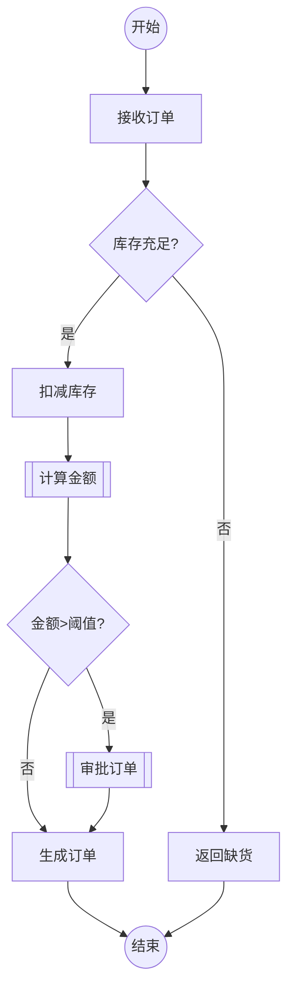

# KEA 流程图图示说明（Mermaid 规范）

> 本文档定义 KEA 流程图中使用的 Mermaid 节点类型和语义规范。
> Agent 生成流程图时必须遵循此规范。

---

## 节点类型映射

| 业务语义 | Mermaid 形状 | 语法示例 | 说明 |
|---------|-------------|---------|------|
| **开始** | 圆形 | `((开始))` | 流程起点 |
| **结束** | 圆形/旗帜 | `((结束))` 或 `>结束]` | 流程终点 |
| **动作** | 矩形 | `[扣减库存]` | 原子业务动作 |
| **业务活动** | 圆角矩形 | `(审批订单)` | 复合业务活动，可能包含子流程 |
| **判断** | 菱形 | `{库存充足?}` | 条件分支，必须有明确的 Yes/No 出边 |
| **子流程** | 双边矩形 | `[[计算金额]]` | 调用外部逻辑文档 |
| **子流程判断** | 双边菱形 | `{{权限校验通过?}}` | 调用外部逻辑进行判断 |
| **说明** | 子图注释 | 见下方 | 仅为注释，不执行操作 |
| **递归** | 六边形 | `{{循环处理}}` | 重新执行当前流程 |

---

## 标准流程图模板

---

## 命名规范

1. **节点 ID**：使用有意义的缩写，如 `A` `B` `C` 或 `CheckStock` `CalcAmount`
2. **节点标签**：中文业务术语，清晰表达业务含义
3. **边标签**：判断出边必须使用 `|是|` `|否|` 或 `|通过|` `|不通过|` 等二元标签
4. **方向**：默认使用 `TD`（Top-Down），复杂流程可用 `LR`（Left-Right）

---

## 文件组织

- 流程图文件：`ontology/diagrams/{流程名称}.md`
- 每个流程图文件只包含一个 Mermaid flowchart
