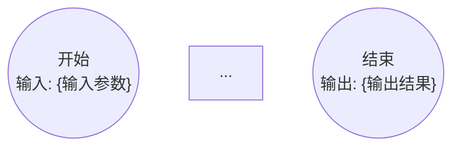

# Phase 3: 流程图生成（Flowchart Generation）

## 定位

本体萃取技能链第 3 阶段。以访谈摘要为底稿，将自然语言描述的业务流程转化为形式化的 Mermaid 流程图，经业务专家确认后作为后续对象/逻辑/动作提取的**权威业务基准**。

**意义**：自然语言存在歧义；Mermaid 流程图将流程逻辑形式化，迫使歧义在提取之前消解。专家对流程图的背书等同于对业务逻辑真相的背书。

## 输入参数

| 参数 | 说明 |
|------|------|
| `DOMAIN_CN` / `DOMAIN_EN` | 领域名 |
| `VAULT_PATH` | Vault 路径 |
| `CHAIN_STATE_PATH` | chain-state 文件路径 |
| `RESEARCH_REPORT_PATH` | G1 产出的调研报告路径 |
| `INTERVIEW_SUMMARY_PATH` | G2 访谈摘要路径 |

目录变量：
```
DIAGRAMS_DIR:         {VAULT_PATH}/30-Ontology/diagrams/{DOMAIN_EN}/
```

## 前置条件检查

读取 `CHAIN_STATE_PATH`，确认 Phase 2 状态为 `✅ 通过`，否则终止。

## 执行步骤

### Step 1: 更新 chain-state.md 为 in_progress

将 Phase 3 状态更新为 `🔄 进行中`。

### Step 2: 确定流程候选清单

读取 `INTERVIEW_SUMMARY_PATH`和 `RESEARCH_REPORT_PATH`，从中提取已确认的逻辑/流程列表。

检查 `DIAGRAMS_DIR` 中是否已有 `.md`（Mermaid）文件：

- **目录为空**：从访谈摘要中重新提取，进入 Step 3（生成模式）
- **目录已有部分文件**：展示已有流程图与尚未生成的流程，询问用户是否补充生成缺失部分

展示流程候选清单：

```
流程图候选清单（共 {N} 个）：

  核心流程（来自访谈确认）：
  【P1】{流程名} — {一句话描述}
  【P2】{流程名} — {一句话描述}
  ...

  已有流程图（如有）：
  ✅ 【P3】{流程名} — 已存在，可跳过或重新生成
```

询问用户：
> "请确认生成范围：
> - ✅ 生成全部（{N} 个，已有的重新覆盖）
> - 🔄 仅生成缺失（{M} 个，已有的保留）
> - ➕ 添加额外流程：[描述]
> - 调整：[从清单移除 P{n}]"

### Step 3: 生成 Mermaid 流程图

Mermaid 节点类型约定：

| 形状语法 | 节点类型 | 用途 |
|---------|---------|------|
| `((开始))` / `((结束))` | 开始 / 结束 | 流程进出点 |
| `[动作描述]` | 动作节点 | 执行一个业务操作 |
| `(活动描述)` | 活动节点 | 业务活动（带上下文） |
| `{判断条件?}` | 判断节点 | 二值分支（必须有"是"和"否"两条出路） |
| `[[子流程名称]]` | 子流程节点 | 调用另一个已定义流程 |
| `{{判断条件?}}` | 子流程判断节点 | 调用子流程并按其结果分支 |

**每个流程图必须包含**：
- 明确标注输入参数的 `((开始))` 节点（注释形式：`%% 输入: 参数名`）
- 明确标注输出结果的 `((结束))` 节点（注释形式：`%% 输出: 结果名`）
- 每个判断节点均有"是"和"否"两条出路
- 所有路径均可到达结束节点

**生成格式**（保存至 `DIAGRAMS_DIR/{流程名}.md`）：

````markdown
---
domain: {DOMAIN_EN}
process: {流程名}
phase: flowchart
created_at: {YYYY-MM-DD}
---


````

每个确认的流程逐一生成，保存文件。

### Step 4: 展示生成结果

```
流程图生成完成（共 {N} 个）：

  ✅ {流程名1} → diagrams/{DOMAIN_EN}/{流程名1}.md
  ✅ {流程名2} → diagrams/{DOMAIN_EN}/{流程名2}.md
  ...

请在 Obsidian 中查看流程图（需安装 Mermaid 预览或 obsidian-mermaid-links 插件）。
```

### Step 5: 逐图人类确认

对每个生成的流程图，展示 Mermaid 代码（或引导用户在 Obsidian 中查看），询问：

> "【{流程名}】流程图已就绪。
>
> - ✅ 确认准确，继续下一个
> - ✏️ 需要调整：[说明修改内容]
> - 🔄 重新生成：[重新描述该流程的业务逻辑]"

- **确认** → 记录该流程图已通过专家确认，继续下一个
- **需要调整** → 按说明修改 Mermaid 文件，重新展示，等待再次确认
- **重新生成** → 重新生成该流程图，重新展示

所有流程图均获专家确认后继续。

## 门控评估（G3）

### 自动验证项

```bash
python3 -m kea --format json mermaid {DIAGRAMS_DIR}
```

| 条件 | 通过标准 | 是否可绕过 |
|------|---------|---------|
| ① 流程图文件已生成 | `DIAGRAMS_DIR` 下文件数 ≥ 访谈确认的流程数 | ❌ 不可绕过 |
| ② Mermaid 语法可解析 | `kea mermaid` 命令无解析错误 | ❌ 不可绕过 |
| ③ 开始/结束节点存在 | 每个流程图有且只有一个 START 和至少一个 END 节点 | ❌ 不可绕过 |
| ④ 判断节点有出路 | 所有 DECISION 节点通过 `decision_branches()` 检查，出路 ≥ 2 | ❌ 不可绕过 |

如有验证失败，说明具体问题并修复，再次验证后继续。

### 人类确认

验证通过后，展示确认汇总：

```
流程图生成完成：

  已生成：{N} 个流程图
  专家确认：{N}/{N} 通过
  解析验证：全部通过

  流程清单：
  ✅ {流程名1} — {一句话描述}
  ✅ {流程名2} — {一句话描述}
  ...
```

询问：
> "所有流程图已完成并获专家确认。是否进入流程图校验（Phase 4）以做深度形式化检查？
>
> - ✅ 继续：进入 Phase 4（建议，发现潜在逻辑问题）
> - ⏭️ 跳过：直接进入 Phase 5（对象提取）"

- **继续** → 更新 chain-state.md，进入 Phase 4
- **跳过** → 更新 chain-state.md，跳至 `current_phase: 5`，告知用户

## 门控通过 → 更新 chain-state.md

```markdown
| 3 | 流程图生成 | ✅ 通过 | {YYYY-MM-DD HH:MM} | 生成 {N} 个流程图，专家全部确认 |
```

追加门控记录：

```markdown
### G3 通过记录（{YYYY-MM-DD HH:MM}）
- 流程图数量：{N} 个 ✅
- Mermaid 解析：全部通过 ✅
- 判断节点分支：全部有效 ✅
- 专家确认：{N}/{N} ✅
- 目录：diagrams/{DOMAIN_EN}/
```

更新 `current_phase: 4`（或 `5` 若用户选择跳过 Phase 4）。

## 门控失败 → 回退处理

| 失败类型 | 处置 |
|---------|------|
| Mermaid 语法错误 | 修复对应文件，重新解析 |
| 判断节点缺少分支 | 补充缺失的出路边，重新验证 |
| 专家拒绝流程图 | 按专家反馈重新生成，重新确认 |
| 访谈摘要不足以生成流程 | 回退到 Phase 2 补充访谈 |

在 chain-state.md 追加回退记录。
