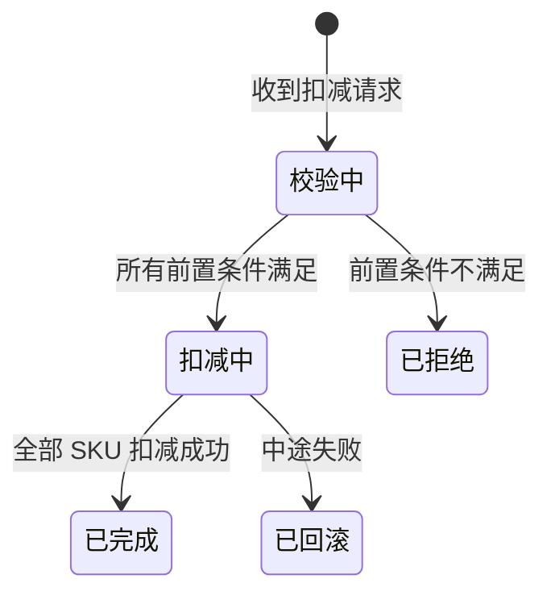

# Ontology 本体建模-实例化-应用总体设计

> 版本：v1.0  
> 日期：2026-04-22  
> 状态：高阶设计（Master Design）  
> 范围：涵盖本体建模、实例化、应用消费、训练、评估全生命周期  
> 约束：面向 Palantir Ontology 范式，大模型原生亲和，后续所有实现以此文档为唯一基准

---

## 目录

1. [设计哲学与核心原则](#1-设计哲学与核心原则)
2. [总体架构](#2-总体架构)
3. [知识层（Knowledge Layer）](#3-知识层knowledge-layer)
4. [训练层（Training Layer）](#4-训练层training-layer)
5. [实例化层（Instantiation Layer）](#5-实例化层instantiation-layer)
6. [运行时层（Runtime Layer）](#6-运行时层runtime-layer)
7. [评估层（Evaluation Layer）](#7-评估层evaluation-layer)
8. [与 Palantir Ontology 的范式映射](#8-与-palantir-ontology-的范式映射)
9. [关键架构决策（ADR）](#9-关键架构决策adr)
10. [实施路线图](#10-实施路线图)

---

## 1. 设计哲学与核心原则

### 1.1 一个根本判断

> **当知识的使用者是 Agent 而非人类/IT 系统时，知识层应成为 Agent 的"操作系统内核"——Agent 直接读取内核原文理解业务，按需生成辅助索引，而非通过确定性的 ETL 管道消费预处理数据。**

这不是对结构化数据的否定，而是对"谁负责结构化"的重新分配：
- **旧思维**：人类设计 Schema → ETL 程序结构化 → 数据库存储 → Agent 查询 API
- **新思维**：人类编写知识文档 → Agent 读取理解 → Agent 按需生成结构化资产 → 运行时调用固化资产

### 1.2 五条核心原则

| 原则 | 含义 | 反模式 |
|------|------|--------|
| **P1. 原文优先** | Markdown 知识文档是唯一事实源，所有派生形态都指向原文 | 数据库 Schema 成为事实源，文档沦为注释 |
| **P2. 确定性编译** | 运行时调用的是"编译后的确定性资产"，不是 Agent 实时生成的代码 | Agent 运行时动态写代码、执行 |
| **P3. 人机协同训练** | Agent 负责生成资产和自动测试，人类负责审核关键决策，系统负责完备性校验 | 纯人工编码，或纯 Agent 自动发布 |
| **P4. 共识评估** | 评估ground_truth不依赖人工标注，由多 LLM 独立理解知识文档后交叉验证生成 | 人工标注数据集，标注滞后且主观 |
| **P5. 分层解耦** | 建模、训练、实例化、运行时、评估五层各有明确契约，层间不穿透 | 一层包揽所有职责，边界模糊 |

### 1.3 关键技术决策

| 决策项 | 决策结果 | 核心理由 |
|--------|---------|---------|
| Agent 何时读取知识文档 | **构建时（训练时）读取**，运行时只调用固化资产 | 运行时确定性要求极高，不能容忍 Agent 每次重新理解的随机性；构建时有充足时间生成、测试、修正 |
| 知识到资产的转化方式 | **训练时做"编译"**（知识→确定性资产） | 不是 IT 时代的 ETL 同步，而是 Agent 理解知识后生成可执行资产，经评估和审核后固化 |
| 数据库选型 | **知识层无数据库**（Git 即存储），**实例化层用 Neo4j**（属性图），**评估层用 SQLite** | Neo4j 成熟、Cypher 查询强、可视化好；知识层不需要数据库，Markdown + Git 足矣 |
| 知识表示格式 | **面向 Agent 的 Markdown**（YAML FM + 语义增强区 + 伪代码 + 状态机 + 规则） | 兼顾人类可读（业务专家能维护）与 Agent 可理解（语义丰富、示例充足、边界清晰） |
| OntologySkill 来源 | **预写骨架（高频确定性）+ Agent 训练生成（边缘场景）+ 人类审核 + Registry 固化** | 高频核心路径用预写骨架保证确定性；边缘场景由 Agent 从知识文档生成；所有资产必须经过评估和审核才能注册 |

---

## 2. 总体架构

### 2.1 五层架构全景

```
┌─────────────────────────────────────────────────────────────────────────────┐
│                           知识层（Knowledge Layer）                          │
│                          ★ 唯一事实源 / 核心指针                              │
│                                                                             │
│   人类编写 + AI 辅助校验                                                     │
│   ├── objects/*.md      # Object Type 定义（对象、属性、关系、状态机）        │
│   ├── logic/*.md        # Logic 定义（流程、分支、子调用、业务规则）          │
│   ├── actions/*.md      # Action Type 定义（触发、前置/后置、回滚）           │
│   └── rules/*.md        # 跨对象业务规则（可执行自然语言）                    │
│                                                                             │
│   存储：Git 仓库                                                             │
│   格式：YAML Front Matter + Markdown Body + 语义增强区                       │
│   设计原则：Agent 可读性优先、人类可维护、Git 版本化                          │
└─────────────────────────────────┬───────────────────────────────────────────┘
                                  │
                    ┌─────────────┴─────────────┐
                    │      训练层（Training Layer）│
                    │                             │
                    │  Agent + Human-in-the-Loop   │
                    │  ├─ 初版生成：Agent 读知识文档 → 生成 OntologySkill/BPM    │
                    │  ├─ 人类审核：代码审查 / 流程审查 / 安全审查       │
                    │  ├─ 自动测试：评估层自动执行全维度验证             │
                    │  ├─ 完备性检查：知识有定义 → 实例化层必有实现      │
                    │  └─ Registry 注册：签名、版本化、溯源               │
                    │                             │
                    │  管理：Git branch（训练中的候选资产）               │
                    └─────────────────────────────┘
                                  │
┌─────────────────────────────────┼───────────────────────────────────────────┐
│                      实例化层（Instantiation Layer）                         │
│                                                                             │
│   ┌─────────────────────────────────────────────────────────────────────┐  │
│   │  固化资产仓库（Registry / Repository）                                │  │
│   │                                                                     │  │
│   │  ├── OntologySkill Registry      # 可执行代码片段（Python/JS）               │  │
│   │  │   └── 溯源：知识文档路径 + git commit hash                        │  │
│   │  ├── BPM Repository      # 流程定义（BPMN / 状态机 / DAG）           │  │
│   │  │   └── 溯源：知识文档路径 + git commit hash                        │  │
│   │  ├── API Catalog         # 服务接口映射（OpenAPI / gRPC）            │  │
│   │  └── Data Schema Cache   # 从知识文档提取的轻量 Schema（JSON/YAML）  │  │
│   │                                                                     │  │
│   │  特征：签名验证、版本化（semver）、依赖解析、灰度发布、回滚           │  │
│   └─────────────────────────────────────────────────────────────────────┘  │
│                                                                             │
│   ┌─────────────────────────────────────────────────────────────────────┐  │
│   │  数据实例存储（Property Graph）                                       │  │
│   │                                                                     │  │
│   │  ├── Neo4j    # 对象实例 + 关系 + 时间化属性                │  │
│   │  └── SQL（辅助）        # 结构化报表、聚合分析                        │  │
│   │                                                                     │  │
│   │  角色：运行时数据载体，Schema 语义来自知识层，不独立维护              │  │
│   └─────────────────────────────────────────────────────────────────────┘  │
│                                                                             │
│   管理：Registry（生产级制品仓库） + 图数据库（运行时数据）                 │
└─────────────────────────────────┬───────────────────────────────────────────┘
                                  │
┌─────────────────────────────────┼───────────────────────────────────────────┐
│                      运行时层（Runtime Layer）                               │
│                                                                             │
│   ┌─────────────────┐  ┌─────────────────┐  ┌─────────────────┐            │
│   │  Orchestrator   │  │  OntologySkill Runtime  │  │  BPM Engine     │            │
│   │  （Agent 编排）  │  │  （原子操作）    │  │  （流程编排）    │            │
│   │                 │  │                 │  │                 │            │
│   │ 理解意图 → 匹配  │  │ 参数校验        │  │ 节点调度        │            │
│   │ 固化资产 → 填充  │  │ 前置/后置检查   │  │ 并行网关        │            │
│   │ 参数 → 调用      │  │ 审计日志        │  │ 人工任务        │            │
│   │                 │  │ 回滚执行        │  │ 超时/补偿       │            │
│   └─────────────────┘  └─────────────────┘  └─────────────────┘            │
│                                                                             │
│   原则：运行时只调用固化资产，不再理解知识                                  │
└─────────────────────────────────────────────────────────────────────────────┘
                                  │
                    ┌─────────────┴─────────────┐
                    │      评估层（Evaluation Layer）│
                    │                             │
                    │  输入：知识文档 + 生成资产     │
                    │  输出：多维评分 + 修正建议     │
                    │                             │
                    │  ├─ 自动基准生成：从知识文档提取契约 + 多 LLM 共识 │
                    │  ├─ 语法验证：AST 解析 + Schema 校验（100% 确定）  │
                    │  ├─ 契约覆盖：前置/后置/回滚覆盖率（形式化匹配）   │
                    │  ├─ 语义一致：多 LLM 交叉验证（共识引擎）          │
                    │  ├─ 沙箱执行：隔离运行 + 副作用检查（100% 确定）   │
                    │  └─ 安全扫描：注入检测 + 密钥扫描（规则驱动）      │
                    │                             │
                    │  原则：ground_truth 零人工标注                       │
                    └─────────────────────────────┘
```

### 2.2 数据流与控制权

```
【设计时】人类编辑知识文档 → Git commit
    ↓
【训练时】Agent 读取知识文档 → 生成候选资产
    ↓
【评估时】评估层自动验证 → 生成报告
    ↓
【审核时】人类审查报告 + 关键代码 → 决策通过/驳回/修正
    ↓
【发布时】Registry 注册 → 签名 + 版本化 + 溯源
    ↓
【运行时】Orchestrator 匹配资产 → 调用执行
    ↓
【反馈时】运行时数据回流 → 触发重训练（可选）
```

**关键控制点**：
- 只有训练层可以写 Registry（经过评估 + 人类审核）
- 运行时层只读 Registry（确定性调用）
- 知识层只有人类可以写（Agent 可建议但不可直接修改）

---

## 3. 知识层（Knowledge Layer）

### 3.1 设计目标

知识层不是"给人看的文档"，而是**Agent 的操作系统内核**。它需要同时满足：
1. **Agent 可理解**：LLM 读取后能准确掌握业务定义、约束、边界
2. **人类可维护**：业务专家能用文本编辑器直接修改
3. **Git 可版本化**：diff 可阅读、可回滚、可分支
4. **评估可验证**：文档中的定义能自动转化为测试用例

### 3.2 统一文档格式：Agent-Native Markdown

融合 YAML Front Matter 的声明能力、Markdown Body 的叙事能力、以及面向 Agent 的语义增强区。

```markdown
---
ontology_version: "3.0"
type: action
id: deduct_inventory
name: 扣减库存
aliases: [库存扣减, 出库]

# Agent 理解辅助区
agent_context:
  one_liner: "根据订单商品数量扣减 SKU 可用库存，库存不足时拒绝"
  
  typical_scenarios:
    - "用户支付成功后触发库存扣减"
    - "批量订单需要逐 SKU 检查库存"
  
  common_misconceptions:
    - "扣减库存 ≠ 锁定库存（锁定是预留，扣减是正式减少）"
    - "库存不足时应拒绝整个订单，不应部分扣减"
  
  related_importance:
    库存: critical
    订单: critical
    订单项: high
---

# 触发条件
订单支付成功后，由支付回调触发。

# 前置条件
1. 库存.可用数量 >= 订单.商品数量
2. 订单.状态 == "待支付"
3. 订单项.SKU 在库存中存在记录

# 执行逻辑（伪代码 + 自然语言）
```pseudo
function deduct_inventory(order_id):
    order = 查询订单(order_id)
    assert order.状态 == "待支付", "订单状态非法"
    
    for item in order.商品项:
        inventory = 查询库存(item.SKU)
        assert inventory.可用数量 >= item.数量, "库存不足: " + item.SKU
    
    // 原子扣减
    for item in order.商品项:
        inventory = 查询库存(item.SKU)
        inventory.可用数量 -= item.数量
        inventory.累计出库 += item.数量
        记录日志("deduct", order_id, item.SKU, item.数量)
    
    return success
```

# 后置条件
1. 库存.可用数量 = 原数量 - 商品数量
2. 库存.变动日志新增一条记录
3. 订单.状态保持不变（本 Action 不修改订单状态）

# 回滚规则
若扣减过程中任一 SKU 失败，已扣减的数量必须恢复，日志记录标记为"已回滚"。

# 状态机


# 关联对象
- 当前 Action 使用 → [[库存]]（读取可用数量、修改可用数量）
- 当前 Action 使用 → [[订单]]（读取状态、商品项）
- 当前 Action 创建 → [[库存变动日志]]（新增记录）
```

### 3.3 格式规范要点

| 区域 | 用途 | 是否必须 | 机器可读性 |
|------|------|---------|-----------|
| YAML Front Matter | 元数据、Agent 理解辅助 | 是 | 100%（结构化） |
| 触发条件 | 何时执行本 Action | 是 | 80%（需 LLM 解析） |
| 前置条件 | 执行前必须满足的断言 | 是 | 90%（伪代码辅助） |
| 执行逻辑 | 业务步骤 + 伪代码 | 是 | 85%（伪代码结构化） |
| 后置条件 | 执行后必须满足的断言 | 是 | 90%（伪代码辅助） |
| 回滚规则 | 失败时如何恢复 | 是 | 80%（自然语言） |
| 状态机 | 可视化状态流转 | 推荐 | 70%（Mermaid 可解析） |
| 关联对象 | 与哪些对象有关系 | 是 | 95%（Obsidian 链接） |

### 3.4 知识层与实例化层的契约

知识文档中的定义必须能自动转化为实例化层的可验证契约：

```
知识文档中的 "前置条件"
    ↓ 契约提取器（Contract Extractor）
形式化契约（FormalCondition）
    ├─ 表达式：inventory.available >= order.quantity
    ├─ 变量：{inventory.available: int, order.quantity: int}
    └─ 边界：{inventory.available: [0, MAX], order.quantity: [1, MAX]}
    ↓ 测试用例生成器
自动测试用例（TestCase）
    ├─ 边界值：刚好满足、刚好不满足
    ├─ 等价类：有效输入、无效输入
    └─ 组合：所有前置条件的真假组合
    ↓ OntologySkill 代码评估器
覆盖率报告（CoverageReport）
    ├─ 前置条件覆盖率：3/3（100%）
    ├─ 边界条件覆盖：5/5（100%）
    └─ 未覆盖路径：无
```

---

## 4. 训练层（Training Layer）

### 4.1 核心流程

训练不是一次性生成，而是**多轮迭代的人机协作工作流**。

```
知识文档更新（Git push）
    ↓ 触发训练管道
Step 1: Agent 初版生成
    ├─ 读取知识文档
    ├─ 选择固化方式（OntologySkill / BPM / API 映射）
    └─ 生成候选资产 + 自动提取的测试用例
    ↓
Step 2: 自动评估（评估层全维度验证）
    ├─ 语法检查
    ├─ 契约覆盖
    ├─ 语义一致性（多 LLM 共识）
    ├─ 沙箱执行
    └─ 安全扫描
    ↓
Step 3: 人类审核（Human-in-the-Loop）
    ├─ 查看评估报告（雷达图 + 失败归因）
    ├─ 审查关键代码（聚焦评估未覆盖的边界）
    └─ 决策：通过 / 驳回 / 要求修正
    ↓
    ├─ 驳回 → Agent 读取失败报告 → 生成修正版 → 回到 Step 2
    │
    └─ 通过 → Step 4: 完备性检查
        ├─ 知识文档中定义的每个 Action/Logic 都有对应固化资产
        ├─ 所有子流程引用都已发布
        └─ 无 dangling reference
        ↓
        Step 5: Registry 注册
            ├─ 版本化（semver）
            ├─ 签名（防篡改）
            ├─ 溯源（知识文档路径 + git hash）
            └─ 发布到生产 Registry
```

### 4.2 完备性检查（Completeness Check）

这是训练层的关键质量控制点。

| 规则 | 说明 | 违反后果 |
|------|------|---------|
| **R1** | 每个 Action 文档必须有对应的 OntologySkill 或 BPM 资产 | 训练管道阻塞，不允许注册 |
| **R2** | 每个 Logic 文档必须有对应的 BPM 流程或 OntologySkill 编排器 | 训练管道阻塞 |
| **R3** | Logic 引用的子 Logic/Action 必须已发布到 Registry | 训练管道阻塞 |
| **R4** | Action 的前置条件必须在固化资产中实现 | 评估失败，需修正 |
| **R5** | Action 的后置条件必须在固化资产中实现 | 评估失败，需修正 |
| **R6** | 回滚规则必须在固化资产中实现 | 评估失败，需修正 |
| **R7** | 知识文档版本与固化资产溯源版本必须一致 | 警告，触发增量重训练 |

完备性检查作为 CI/CD 门禁：

```yaml
# .github/workflows/completeness-check.yml
steps:
  - name: Completeness Check
    run: |
      python -m ontology.tools.completeness \
        --knowledge-dir ./ontology \
        --registry-url ${{ secrets.REGISTRY_URL }} \
        --fail-on critical
  
  - name: Post PR Comment
    if: failure()
    # 自动 PR 评论：列出缺失的资产和受影响的 Skill
```

### 4.3 固化方式选择策略

| 场景 | 固化方式 | 理由 |
|------|---------|------|
| 单步原子操作（扣减库存、发送通知） | **OntologySkill 片段** | 轻量、可组合、易测试 |
| 简单条件分支（if/else，无并行） | **OntologySkill 片段** | 代码表达更简洁 |
| 长流程（>5 步）、多人审批 | **BPM 流程** | 可视化、状态持久化、超时处理 |
| 并行分支（同时发起多个审批） | **BPM 流程** | 引擎原生支持并行网关 |
| 需要人工介入（待办任务） | **BPM 流程** | 任务分配、提醒、委托 |
| 混合场景 | **BPM 流程 + OntologySkill 节点** | 流程骨架用 BPM，原子操作用 OntologySkill |

---

## 5. 实例化层（Instantiation Layer）

### 5.1 两层结构

### 5.1 OntologySkill 定义

> **OntologySkill** 是面向 Agent 执行过程的**确定性逻辑片段**，从知识文档中的 Action/Logic 定义训练生成，经评估和审核后固化到 Registry。
>
> 它不是 Agent 的通用 Skill（如"总结文本""翻译语言"），而是**业务领域内的确定性操作单元**：
> - 可以是代码片段（Python/JS 函数）
> - 可以是脚本调用（Shell/Python 脚本）
> - 可以是程序调用（可执行二进制）
> - 可以是 API 调用（REST/gRPC 接口封装）
>
> 核心特征：**确定性**——给定相同输入，永远产生相同输出和副作用。

实例化层包含**资产仓库**（定义）和**数据存储**（实例）两个子层：

```
实例化层
├── 资产仓库（Registry / Repository）
│   ├── OntologySkill Registry      # 确定性逻辑片段（代码/脚本/API 封装）
│   ├── BPM Repository              # 流程级资产（流程定义）
│   ├── API Catalog                 # 服务接口映射（OpenAPI / gRPC）
│   └── Schema Cache                # 轻量 Schema（运行时快速加载）
│
└── 数据存储（Property Graph + SQL）
    ├── Neo4j                       # 对象实例 + 关系 + 时间化
    └── SQL（辅助）                  # 报表、聚合、全文检索
```

### 5.2 Registry 核心规范

每个固化资产必须携带不可变的溯源信息：

```yaml
asset_id: "skills/deduct_inventory"
version: "1.2.3"
kind: "skill"

provenance:
  knowledge_source: "ontology/actions/扣减库存.md"
  knowledge_version: "abc123def456"  # git commit hash
  generated_by: "agent:training-v1.2"
  generated_at: "2026-04-22T10:00:00Z"
  reviewed_by: "human:zhangsan"
  review_status: "approved"
  training_session: "session-20260422-001"

runtime:
  entrypoint: "deduct_inventory"
  language: "python"
  sandbox: "docker"
  timeout: 30
  
  dependencies:
    - "skills/query_inventory:>=1.0.0"
  
  preconditions:
    - "inventory.available >= order.quantity"
  
  postconditions:
    - "inventory.available == old.available - order.quantity"
  
  rollback: "inventory.available += order.quantity"
  
  audit:
    log_level: "full"
    retention_days: 365

security:
  network: "restricted"
  filesystem: "read-only"
  env_vars: ["DB_URL", "REDIS_URL"]

signature:
  algorithm: "sha256"
  value: "e3b0c44298fc1c149afbf4c8996fb92427ae41e4649b934ca495991b7852b855"
  signed_by: "registry:prod"
```

### 5.3 数据存储的定位

| 数据库 | 存储内容 | 来源 | 维护者 |
|--------|---------|------|--------|
| **Neo4j** | 对象实例、关系、属性值、状态历史 | 业务系统运行时写入 | 数据工程师 |
| **SQL** | 聚合报表、全文检索索引、审计日志 | 从图数据库同步或业务系统直接写入 | 数据工程师 |
| **Schema Cache** | 从知识文档提取的轻量 Schema（JSON） | 训练时生成 | 训练管道 |

**关键原则**：图数据库不维护 Schema 定义，Schema 定义在知识层的 Markdown 中。图数据库只存储实例数据和关系。

---

## 6. 运行时层（Runtime Layer）

### 6.1 Orchestrator：Agent 的唯一职责

运行时 Agent 不是"理解知识后动态执行"，而是**理解用户意图后匹配并调用固化资产**。

```python
class Orchestrator:
    def execute(self, user_query: str, context: RuntimeContext) -> ExecutionResult:
        # Step 1: 意图理解（LLM）
        intent = self.understand_intent(user_query)
        
        # Step 2: 实体识别（匹配知识文档中的对象/Action）
        entities = self.resolve_entities(intent, context)
        
        # Step 3: 资产匹配（从 Registry 查找对应的 OntologySkill/BPM）
        asset = self.registry.match(intent, entities)
        
        # Step 4: 参数填充（从用户输入和上下文中提取参数）
        params = self.extract_params(intent, entities, asset.input_schema)
        
        # Step 5: 执行调度
        if asset.kind == "skill":
            return self.skill_runtime.execute(asset, params, context)
        elif asset.kind == "bpm":
            return self.bpm_engine.start_process(asset, params, context)
```

### 6.2 OntologySkill Runtime

```python
class SkillRuntime:
    def execute(self, asset: Asset, params: dict, context: RuntimeContext) -> ExecutionResult:
        # 1. 加载 + 签名校验
        code = self.registry.load(asset.id, asset.version)
        code.verify_signature()
        
        # 2. 参数校验（基于 Schema）
        validated = self.validate_params(asset.input_schema, params)
        
        # 3. 前置条件检查（强制执行）
        self.check_preconditions(asset.preconditions, validated, context)
        
        # 4. 沙箱执行
        result = self.sandbox.execute(code.entrypoint, validated, context)
        
        # 5. 后置条件检查
        self.check_postconditions(asset.postconditions, result, context)
        
        # 6. 审计日志
        self.audit.log(asset, params, result, context)
        
        return result
    
    def rollback(self, execution_id: str) -> None:
        record = self.audit.get(execution_id)
        asset = self.registry.load(record.asset_id, record.version)
        if asset.rollback:
            self.sandbox.execute(asset.rollback, record.params, record.context)
```

### 6.3 BPM Engine

```python
class BPMEngine:
    def start_process(self, asset: Asset, variables: dict, context: RuntimeContext) -> ProcessInstance:
        # 加载流程定义
        definition = self.registry.load(asset.id, asset.version)
        
        # 创建流程实例（持久化到图数据库）
        instance = ProcessInstance(definition, variables)
        self.state_store.save(instance)
        
        # 启动第一个节点
        self.execute_node(instance, definition.start_node, context)
        
        return instance
    
    def execute_node(self, instance: ProcessInstance, node: Node, context: RuntimeContext):
        if node.type == "serviceTask":
            # 调用 OntologySkill Runtime
            result = self.skill_runtime.execute(node.skill_asset, node.build_params(instance), context)
            instance.variables.update(result.data)
        elif node.type == "userTask":
            # 创建人工任务
            self.task_service.create_task(instance, node)
            instance.state = "waiting"
        elif node.type == "exclusiveGateway":
            next_node = self.evaluate_conditions(node, instance.variables)
            self.execute_node(instance, next_node, context)
            return
        elif node.type == "parallelGateway":
            for branch in node.branches:
                self.executor.submit(self.execute_branch, instance, branch, context)
            return
        
        # 流转
        if node.next:
            self.execute_node(instance, node.next, context)
        else:
            instance.state = "completed"
            self.state_store.save(instance)
```

---

## 7. 评估层（Evaluation Layer）

### 7.1 核心创新：零人工标注

评估层不依赖人工标注的 ground_truth，而是通过两种机制自动生成评估基准：

| 机制 | 原理 | 适用场景 |
|------|------|---------|
| **形式化契约提取** | 从知识文档的前置/后置/回滚规则中自动提取可执行的断言和测试用例 | 契约覆盖评估、沙箱执行验证 |
| **多 LLM 共识基准** | 多个异构 LLM 独立理解知识文档后生成参考答案，取事实级共识作为基准 | 语义一致性评估、端到端 Agent 评估 |

### 7.2 多 LLM 共识引擎

```
被评估资产（OntologySkill / BPM / Agent 回答）
    ↓
┌─────────────────────────────────────────┐
│  多个 LLM 独立评估（并行）               │
│  ├─ GLM-4: 评分 + 理由                  │
│  ├─ GPT-4: 评分 + 理由                  │
│  ├─ Claude: 评分 + 理由                 │
│  └─ Qwen: 评分 + 理由                   │
└─────────────────────────────────────────┘
    ↓
共识聚合
    ├─ 一致性检测（标准差 < 0.1 → 高度一致）
    ├─ 可信度加权（偏离共识的模型降权）
    └─ 分歧报告（列出具体分歧点）
    ↓
最终评分 + 置信区间
```

### 7.3 五维评估体系

| 维度 | 方法 | 确定性 | 关键指标 |
|------|------|--------|---------|
| **语法/结构** | AST 解析 + Schema 校验 | 100% | 可编译、类型一致、依赖可解析 |
| **契约覆盖** | 形式化匹配（契约提取器 vs 代码） | 90% | 前置/后置/回滚覆盖率 |
| **语义一致** | 多 LLM 共识（代码逻辑 vs 知识文档） | 75% | 概念对齐度、规则遵守度 |
| **运行时正确** | 沙箱执行 + 自动测试用例 | 100% | 测试通过率、副作用清洁度 |
| **安全合规** | 静态规则扫描 | 95% | 无注入、无硬编码密钥、权限边界正确 |

### 7.4 自动测试用例生成

从 Action 文档自动生成边界测试：

```yaml
# 从 "inventory.available >= order.quantity" 自动生成
test_cases:
  - name: "边界-刚好满足"
    input: { available: 10, quantity: 10 }
    expected: { result: success, remaining: 0 }
  
  - name: "边界-刚好不满足"
    input: { available: 9, quantity: 10 }
    expected: { result: error, error_type: precondition_violation }
  
  - name: "边界-零库存"
    input: { available: 0, quantity: 1 }
    expected: { result: error, error_type: precondition_violation }
  
  - name: "正常-充足库存"
    input: { available: 100, quantity: 10 }
    expected: { result: success, remaining: 90, logs_delta: +1 }
  
  - name: "回滚-中途失败"
    input: { available: 100, quantity: 10, simulate_failure: after_first_deduct }
    expected: { result: error, remaining: 100, logs_delta: 0 }
```

---

## 8. 与 Palantir Ontology 的范式映射

### 8.1 概念映射

| Palantir 概念 | 本设计对应 | 说明 |
|--------------|---------|------|
| **Object Type** | 知识层 `objects/*.md` | 对象 Schema 定义，Markdown 格式 |
| **Object** | 实例化层 KùzuDB/Neo4j | 对象实例，带 RID 和时间化属性 |
| **Link Type** | 知识层 `objects/*.md` 中的 `relations` | 关系类型定义 |
| **Link** | 实例化层图数据库中的边 | 关系实例，可带属性和时间戳 |
| **Property** | 知识层属性表 + 实例化层属性值 | 强类型属性系统 |
| **Action Type** | 知识层 `actions/*.md` | 动作 Schema 定义 |
| **Function** | 实例化层 Registry 中的 OntologySkill | 固化的可执行函数 |
| **Action** | 运行时层 OntologySkill Runtime 的一次调用 | 动作执行实例 |
| **Temporal** | 实例化层状态历史 + 审计日志 | 一切状态变更带时间戳 |

### 8.2 关键差异：Palantir 是闭源产品，本设计是开放架构

| 维度 | Palantir Foundry | 本设计 |
|------|-----------------|--------|
| 知识表示 | 专有 UI + 后端配置 | Markdown + Git（开放格式） |
| Function 编写 | 直接在平台写 Python | Agent 从知识文档训练生成 |
| 运行时 | Palantir 托管 | 自建 Registry + 运行时 |
| 数据源连接 | Palantir 专用 Connector | 通用 API/数据库连接 |
| 评估机制 | 内部质量保障 | 多 LLM 交叉验证 + 自动基准 |

### 8.3 定位差异

> **Palantir 是 "Ontology as a Product"。本设计是 "Ontology as an Open System"。**

Palantir 提供的是**完整的闭源产品**，用户在其平台上定义 Ontology、编写 Function、运行业务。本设计提供的是**开放的架构规范**，用户可以在任何基础设施上实现这套规范，知识文档用 Git 管理，运行时自建或托管。

---

## 9. 关键架构决策（ADR）

### ADR-001：知识层格式选择

**决策**：采用 Markdown + YAML Front Matter + 语义增强区，不用纯 YAML Schema。

**理由**：
- Markdown 是人类最自然的阅读和编辑格式
- YAML FM 提供结构化元数据，便于程序解析
- 语义增强区（one_liner / typical_scenarios / common_misconceptions）显著提升 Agent 理解准确率
- 纯 YAML Schema（如 Palantir 风格）对人类不友好，业务专家难以维护

**后果**：需要维护 Markdown 解析器，处理 YAML FM 和 Body 的分离。

### ADR-002：Agent 读知识的时机

**决策**：Agent 在**构建时（训练时）**读取知识文档，运行时只调用固化资产。

**理由**：
- 运行时确定性要求极高（金融交易、库存扣减），不能容忍 Agent 每次重新理解的随机性
- 构建时 Agent 有充足时间理解、生成、测试、修正
- 运行时只需"意图理解 + 资产匹配 + 参数填充"，延迟可控

**后果**：知识文档更新后，需要重新走训练管道才能生效，存在训练周期。

### ADR-003：评估 ground_truth 来源

**决策**：ground_truth 从知识文档**自动提取**，不依赖人工标注。

**理由**：
- 人工标注成本高、更新慢、主观性强
- 知识文档中的前置/后置/回滚规则本身就是形式化契约，可直接提取
- 多 LLM 共识可以覆盖无法形式化提取的维度（语义质量）

**后果**：契约提取器的准确率直接影响评估质量，需要持续优化。

### ADR-004：属性图数据库选型

**决策**：实例化层使用 **Neo4j**（属性图数据库）。

**理由**：
- Neo4j 是成熟的属性图数据库，Cypher 查询能力强，可视化生态完善
- 已有 `ontology-instantiation-main` 项目基于 Neo4j 建设，资产可复用
- 与知识层的 Markdown 解耦：图数据库存实例，Schema 语义来自知识层 Markdown

**后果**：需要独立部署 Neo4j 服务，运维复杂度高于嵌入式数据库。

### ADR-005：OntologySkill 与 BPM 的边界

**决策**：原子操作用 OntologySkill（代码），长流程用 BPM（流程定义），BPM 节点可调用 OntologySkill。

**理由**：
- 代码适合表达原子逻辑（校验、计算、API 调用）
- 流程引擎适合表达长流程（审批、并行、人工任务、超时）
- 两者不是互斥的，BPM 的 ServiceTask 节点直接调用 OntologySkill

**后果**：需要维护两套运行时（OntologySkill Runtime + BPM Engine），但有统一接口。

### ADR-006：运行时 Agent 的角色

**决策**：运行时 Agent 是**编排者（Orchestrator）**，不是执行者（Executor）。

**理由**：
- 编排需要灵活性（理解意图、匹配资产、处理多轮对话）
- 执行需要确定性（调用固化资产、强制执行契约）
- 分离后，执行层可以独立优化性能、安全、审计

**后果**：Orchestrator 的设计必须简洁，不能包含业务逻辑，否则会成为新的不确定性来源。

---

## 10. 实施路线图

### Phase 0：基础设施（4-6 周）

| 任务 | 产出 | 验收标准 |
|------|------|---------|
| 知识文档格式规范定稿 | `specs/knowledge-doc-format-v1.md` | 覆盖 Object/Logic/Action 的完整 YAML FM Schema |
| 契约提取器 MVP | `extractors/contract_extractor.py` | 能从 Action 文档提取前置/后置/回滚，准确率 > 80% |
| 测试用例生成器 MVP | `generators/test_case_generator.py` | 自动生成边界值 + 等价类 + 组合测试 |
| 多 LLM 评估客户端 | `evaluators/multi_llm_client.py` | 支持 3+ 模型并行评估 |

### Phase 1：训练管道（6-8 周）

| 任务 | 产出 | 验收标准 |
|------|------|---------|
| 训练工作流引擎 | `training/workflow.py` | 支持 生成→评估→审核→注册 完整流程 |
| OntologySkill 生成 Agent | `training/ontology_skill_generator.py` | 能从 Action 文档生成可编译的 Python 代码 |
| 人类审核界面 | `training/review-ui/` | 展示评估雷达图、代码 diff、审核清单 |
| 完备性检查器 | `training/completeness_checker.py` | R1-R7 规则全部实现，CI 集成 |

### Phase 2：运行时（6-8 周）

| 任务 | 产出 | 验收标准 |
|------|------|---------|
| Registry 服务 | `registry/service.py` | 支持 publish/resolve/rollback/canary |
| OntologySkill Runtime | `runtime/ontology_skill_engine.py` | 参数校验 + 前置/后置 + 沙箱 + 审计 |
| BPM Engine MVP | `runtime/bpm_engine.py` | 顺序流 + 条件分支 + 并行网关 + 人工任务 |
| Orchestrator | `runtime/orchestrator.py` | 意图理解 + 资产匹配 + 参数填充 + 调用执行 |
| Neo4j 集成 | `runtime/neo4j_client.py` | 对象实例 CRUD + 关系查询 + 状态历史 |

### Phase 3：评估平台（6-8 周）

| 任务 | 产出 | 验收标准 |
|------|------|---------|
| 共识引擎 | `evaluators/consensus_engine.py` | 支持 4+ 模型，一致性检测 + 分歧报告 |
| 契约覆盖评估 | `evaluators/contract_coverage.py` | 前置/后置/回滚覆盖率计算 |
| 语义一致性评估 | `evaluators/semantic_consistency.py` | 多 LLM 共识驱动，与知识文档对齐度 |
| 沙箱执行器 | `sandbox/executor.py` | 隔离执行 + 副作用检查 + 性能分析 |
| 安全扫描器 | `evaluators/security_scanner.py` | 注入检测 + 密钥扫描 + 权限分析 |
| 端到端评估 | `evaluators/e2e_evaluator.py` | 自动基准生成 + Agent 回答评估 |

### Phase 4：整合与闭环（长期）

| 任务 | 产出 | 验收标准 |
|------|------|---------|
| 运行时反馈收集 | `feedback/collector.py` | 异常、性能、用户满意度自动回流 |
| 自动重训练触发 | `training/auto_trigger.py` | 异常率 > 阈值时自动触发 |
| 知识文档质量分析 | `training/doc_quality.py` | 发现导致训练失败率高的文档模式 |
| A/B 测试框架 | `training/ab_test.py` | 比较不同版本 OntologySkill 的业务效果 |

---

## 11. 附录：术语表

| 术语 | 定义 |
|------|------|
| **Ontology** | 业务的数字孪生：对象类型、关系、属性、动作、函数的完整定义 |
| **知识文档** | Markdown 格式的 Ontology 定义，唯一事实源 |
| **OntologySkill** | 面向 Agent 执行过程的确定性逻辑片段，从知识文档训练生成，可表现为代码/脚本/API 封装，对应 Palantir Function |
| **BPM** | 业务流程模型定义，对应长流程编排 |
| **Registry** | 生产级制品仓库，存储签名、版本化的固化资产 |
| **契约** | 前置条件、后置条件、回滚规则的形式化表示 |
| **共识引擎** | 多 LLM 独立评估后聚合结果的算法 |
| **Orchestrator** | 运行时 Agent，负责意图理解、资产匹配、参数填充 |
| **完备性** | 知识文档中定义的每个 Action/Logic 在实例化层都有对应实现 |
| **Agent-Native** | 面向 Agent 理解优化的格式设计 |

---

> **本文档是后续所有实现的唯一基准。任何架构变更必须经过 ADR 流程记录，并更新本文档。**
