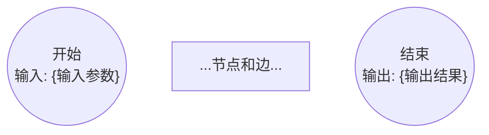

# Phase 3/4 AgentFile 编排层实现计划

> **For agentic workers:** REQUIRED SUB-SKILL: Use superpowers:subagent-driven-development (recommended) or superpowers:executing-plans to implement this plan task-by-task. Steps use checkbox (`- [ ]`) syntax for tracking.

**Goal:** 将 Phase 3 的流程图生成职责移入新 sub-skill，批量确认替代逐图确认；Phase 4 Phase A 改用 `kea flowchart-check` 确定性工具。

**Architecture:** 新增 `generate-flowcharts` 生成型 sub-skill；重写 `phase-3-flowchart-generate.md`（Step 2 用户确认候选 → Step 3 Dispatch sub-skill → Step 4 结构校验 → Step 5 批量确认）；小改 `phase-4-flowchart-validate.md`（Phase A 改用 `kea flowchart-check`）；安装验证。

**Tech Stack:** Markdown + YAML frontmatter（AgentFile Skill 格式）；依赖 `kea flowchart-check` 命令（由计划 A 实现）。

**前置条件：** 计划 A（`kea flowchart-check`）必须先完成，本计划依赖该命令已可用。

---

## 文件变更清单

| 操作 | 文件 | 说明 |
|------|------|------|
| 新增 | `AgentFile/skills/generate-flowcharts/SKILL.md` | 生成型 sub-skill，一次性生成所有流程图 |
| 重写 | `AgentFile/phases/phase-3-flowchart-generate.md` | 新编排：候选确认 → sub-skill → 结构校验 → 批量确认 |
| 小改 | `AgentFile/phases/phase-4-flowchart-validate.md` | Phase A 改用 `kea flowchart-check` |

---

## Task 1: 新增 generate-flowcharts sub-skill

**Files:**
- Create: `AgentFile/skills/generate-flowcharts/SKILL.md`

- [ ] **Step 1: 创建目录并写入 SKILL.md**

创建 `AgentFile/skills/generate-flowcharts/SKILL.md`，内容：

```markdown
<SUBAGENT-STOP>
本文件作为 subagent 执行。若你是主 session Claude，请通过 Agent 工具 Dispatch 本 skill，而非直接读取执行。
</SUBAGENT-STOP>

# generate-flowcharts — 流程图批量生成

你是一个生成型 subagent。根据传入的流程候选清单和源文档，生成符合 KEA 约定的 Mermaid 流程图文件，写入 DIAGRAMS_DIR。

**你不与用户交互，不做候选清单判断，只负责生成。**

## 输入参数（由 phase-3 在 Dispatch 时传入）

- `CONFIRMED_CANDIDATES`：用户确认的流程清单（JSON 数组，每项含 `name`（流程名）和 `description`（一句话描述））
- `RESEARCH_REPORT_PATH`：调研报告路径
- `INTERVIEW_SUMMARY_PATH`：访谈摘要路径
- `SUPPLEMENT_PATH`：可选，补充调研文档路径（为空时忽略）
- `DIAGRAMS_DIR`：输出目录（已含领域名，格式：`.../diagrams/{DOMAIN_EN}/`）
- `DOMAIN_CN` / `DOMAIN_EN`：领域信息
- `EXISTING_FILES`：可选，已有流程图文件列表（增量模式，传入时跳过已存在的）

## 执行步骤

### Step 0: 参数校验

若 `CONFIRMED_CANDIDATES` 为空或未传入，返回：
```
状态：NEEDS_CONTEXT
缺少信息：CONFIRMED_CANDIDATES 为空，无法确定需要生成哪些流程图
```

若 `DIAGRAMS_DIR` 为空或未传入，返回：
```
状态：NEEDS_CONTEXT
缺少信息：DIAGRAMS_DIR 未传入，无法确定写入位置
```

### Step 1: 读取源文档

依次读取以下文档作为生成上下文（使用 Read 工具）：
1. `RESEARCH_REPORT_PATH`（若存在）
2. `INTERVIEW_SUMMARY_PATH`（若存在）
3. `SUPPLEMENT_PATH`（若非空且存在）

优先级：补充文档 > 访谈摘要 > 调研报告（专家显式确认的优先）。

### Step 2: 逐一生成流程图

对 `CONFIRMED_CANDIDATES` 中每个条目，生成 Mermaid 流程图：

**节点约定（严格遵守，不允许自行发明其他形状）：**

| 形状语法 | 节点类型 | 约束 |
|---------|---------|------|
| `((开始\n输入: {参数名}))` | 开始节点 | 每图有且仅有 1 个 |
| `((结束\n输出: {结果名}))` | 结束节点 | 每图至少 1 个 |
| `[动作描述]` | 动作节点 | 描述一个业务操作 |
| `(活动描述)` | 活动节点 | 描述一个业务活动（带上下文） |
| `{条件?}` | 判断节点 | 必须有 `\|是\|` 和 `\|否\|` 两条出路 |
| `[[子流程名称]]` | 子流程引用 | 名称须与 CONFIRMED_CANDIDATES 中其他流程名一致 |

**文件格式**（写入 `{DIAGRAMS_DIR}/{流程名}.md`）：

````markdown
---
domain: {DOMAIN_EN}
process: {流程名}
phase: flowchart
created_at: {YYYY-MM-DD}
---


````

每生成一个文件立即写入，不等所有生成完再批量写。

**低置信处理**：若源文档对某流程描述严重不足（找不到触发条件、关键判断节点等），在内部记录为低置信候选，最终在疑虑清单中列出。

### Step 3: 返回结果

**DONE（全部正常生成）：**
```
状态：DONE

生成统计：{N} 个流程图
  ✅ {流程名1} → diagrams/{DOMAIN_EN}/{流程名1}.md
  ✅ {流程名2} → diagrams/{DOMAIN_EN}/{流程名2}.md
  ...
```

**DONE_WITH_CONCERNS（有低置信项）：**
```
状态：DONE_WITH_CONCERNS

生成统计：{N} 个流程图（{K} 个存在疑虑）

疑虑清单：
- {流程名}：来源文档对该流程描述不足，{具体说明缺少的信息}，关键节点基于模型推断，置信度低
```

**NEEDS_CONTEXT：**
```
状态：NEEDS_CONTEXT
缺少信息：{具体说明}
```

**BLOCKED：**
```
状态：BLOCKED
卡点：{具体说明}
已尝试：{已尝试的方法}
```
```

- [ ] **Step 2: 验证文件**

```bash
head -3 AgentFile/skills/generate-flowcharts/SKILL.md
```

期望：`<SUBAGENT-STOP>` 开头。

```bash
grep "DONE\|DONE_WITH_CONCERNS\|NEEDS_CONTEXT\|BLOCKED" AgentFile/skills/generate-flowcharts/SKILL.md | wc -l
```

期望：≥ 4（四种状态码均出现）。

- [ ] **Step 3: Commit**

```bash
git add AgentFile/skills/generate-flowcharts/SKILL.md
git commit -m "feat: add generate-flowcharts sub-skill for batch Mermaid flowchart generation"
```

---

## Task 2: 重写 phase-3-flowchart-generate.md

**Files:**
- Modify: `AgentFile/phases/phase-3-flowchart-generate.md`（完整替换）

- [ ] **Step 1: Read 当前文件**

```bash
wc -l AgentFile/phases/phase-3-flowchart-generate.md
```

确认文件存在后继续。

- [ ] **Step 2: 完整替换文件内容**

```markdown
# Phase 3: 流程图生成（Flowchart Generation）

## 定位

本体萃取技能链第 3 阶段。从源文档提取流程候选，由专家确认范围，Dispatch generate-flowcharts sub-skill 批量生成 Mermaid 流程图，经结构校验和批量人类确认后作为后续提取的**权威业务基准**。

**意义**：自然语言存在歧义；Mermaid 流程图将流程逻辑形式化，迫使歧义在提取之前消解。专家对流程图的背书等同于对业务逻辑真相的背书。

## 输入参数

| 参数 | 说明 |
|------|------|
| `DOMAIN_CN` / `DOMAIN_EN` | 领域名 |
| `VAULT_PATH` | Vault 路径 |
| `CHAIN_STATE_PATH` | chain-state 文件路径 |
| `RESEARCH_REPORT_PATH` | G1 产出的调研报告路径 |
| `INTERVIEW_SUMMARY_PATH` | G2 访谈摘要路径 |
| `SUPPLEMENT_PATH` | 可选，G2 补充调研文档路径（chain-state front matter 中 `supplement_path` 字段，为空时忽略） |
| `PROJECT_ROOT` | kea 工具层根目录（用于运行 `python3 -m kea`） |

目录变量：
```
DIAGRAMS_DIR: {VAULT_PATH}/30-Ontology/diagrams/{DOMAIN_EN}/
```

## 前置条件检查

读取 `CHAIN_STATE_PATH`，确认 Phase 2 状态为 `✅ 通过`，否则终止。

## 执行步骤

### Step 1: 更新 chain-state.md 为 in_progress

将 Phase 3 状态更新为 `🔄 进行中`。

### Step 2: 确定流程候选清单并获取用户确认

读取 `RESEARCH_REPORT_PATH` 和 `INTERVIEW_SUMMARY_PATH`，若 `SUPPLEMENT_PATH` 非空则同时读取补充文档，三份文档合并提取逻辑/流程候选清单。补充文档中的候选优先级高于调研报告。

检查 `DIAGRAMS_DIR` 中是否已有 `.md` 文件：
- **目录为空** → `EXISTING_FILES = []`，全量模式
- **目录已有文件** → 记录 `EXISTING_FILES`（已有文件名列表），展示给用户

展示候选清单并请用户确认生成范围：

```
流程候选清单（共 {N} 个）：

  【P1】{流程名} — {一句话描述}
  【P2】{流程名} — {一句话描述}
  ...

  已有流程图（如有）：
  ✅ 【P3】{流程名} — 已存在，默认保留

请确认生成范围：
  ✅ 全部生成（{N} 个，已有的重新覆盖）
  🔄 仅生成缺失（{M} 个，已有的保留）
  ➕ 添加额外流程：[描述]
  ✂️ 从清单移除：[P{n}]
```

等待用户确认，得到 `CONFIRMED_CANDIDATES`（JSON 数组，每项含 `name` + `description`）。

### Step 3: Dispatch generate-flowcharts sub-skill

读取 `~/.claude/skills/kea/skills/generate-flowcharts/SKILL.md`，以 Subagent 形式 Dispatch，传入：

```
CONFIRMED_CANDIDATES: {CONFIRMED_CANDIDATES JSON}
RESEARCH_REPORT_PATH: {RESEARCH_REPORT_PATH}
INTERVIEW_SUMMARY_PATH: {INTERVIEW_SUMMARY_PATH}
SUPPLEMENT_PATH: {SUPPLEMENT_PATH}（可选）
DIAGRAMS_DIR: {DIAGRAMS_DIR}
DOMAIN_CN: {DOMAIN_CN}
DOMAIN_EN: {DOMAIN_EN}
EXISTING_FILES: {EXISTING_FILES JSON}（可选）
```

等待返回，读取状态码。

**DONE_WITH_CONCERNS** → 疑虑前置：展示疑虑清单，告知用户哪些流程置信度低，进入 Step 4。

**NEEDS_CONTEXT / BLOCKED** → 展示问题，询问用户是否补充信息重试，或回退至 Phase 2。

**DONE** → 直接进入 Step 4。

### Step 4: 结构校验（kea flowchart-check）

```bash
cd {PROJECT_ROOT} && python3 -m kea --format json flowchart-check {DIAGRAMS_DIR}
```

读取 JSON，展示结果：

```
结构校验（S1-S4）：
  总计：{N} 个，通过：{P} 个，失败：{F} 个
```

若 `summary.failed > 0`，展示失败详情：

```
  ❌ {文件名}：
     [S1] {message}
     [S3] {message}
```

提示：
> "请修复上述结构问题后回复"继续"重新校验。修复方式：直接编辑 `{DIAGRAMS_DIR}` 下对应文件。"

等待用户回复后重跑 `kea flowchart-check`，循环直到 `summary.failed = 0`。

### Step 5: 批量人类确认

结构校验全部通过后：

```
{N} 个流程图已生成并通过结构校验（S1-S4）。

请在 Obsidian 中查看渲染后的流程图：
  📁 30-Ontology/diagrams/{DOMAIN_EN}/

所有流程图审阅完毕后，请回复：
  ✅ 全部确认，继续
  ✏️ 需要调整：[列出流程名 + 具体修改]
```

若用户列出调整项，逐项修改对应 Mermaid 文件，修改后重跑 `kea flowchart-check` 确认无结构破坏，再次展示提示引导用户确认。

循环直到用户回复"全部确认"。

## 门控评估（G3）

### 自动验证项

```bash
cd {PROJECT_ROOT} && python3 -m kea --format json flowchart-check {DIAGRAMS_DIR}
```

| 条件 | 检查方式 | 通过标准 |
|------|---------|---------|
| ① 流程图文件已生成 | 统计 DIAGRAMS_DIR 下 .md 文件数 | ≥ CONFIRMED_CANDIDATES 数量 |
| ② 结构校验全部通过 | kea flowchart-check `summary.failed` | = 0 |
| ③ 专家已批量确认 | 用户在 Step 5 回复"全部确认" | 有记录 |

展示验证结果：

```
自动验证：
  ① 流程图数量：✅ {N} 个（≥ 候选数 {M}）
  ② 结构校验：✅ 全部通过（S1-S4）
  ③ 专家确认：✅ 已批量确认
```

如有失败项，说明原因，不进入人类确认。

### 人类确认

验证全部通过后：

> "流程图生成完成：
>
> - 已生成：{N} 个流程图
> - 结构校验：✅ 全部通过
> - 专家确认：✅ 已完成
>
> 是否进入流程图校验（Phase 4）做深度语义检查？
> - ✅ 继续：进入 Phase 4（建议）
> - ⏭️ 跳过：直接进入 Phase 5（对象提取）"

- **继续** → 更新 chain-state.md，进入 Phase 4
- **跳过** → 更新 chain-state.md，`current_phase: 5`

## 门控通过 → 更新 chain-state.md

```markdown
| 3 | 流程图生成 | ✅ 通过 | {YYYY-MM-DD HH:MM} | 生成 {N} 个，结构校验通过，专家批量确认 |
```

追加门控记录：

```markdown
### G3 通过记录（{YYYY-MM-DD HH:MM}）
- 流程图数量：{N} 个 ✅
- 结构校验（kea flowchart-check）：全部通过 ✅
- 专家批量确认：✅
- 目录：diagrams/{DOMAIN_EN}/
```

更新 `current_phase: 4`（或 `5` 若跳过）。

## 门控失败 → 回退处理

| 失败类型 | 处置 |
|---------|------|
| sub-skill BLOCKED | 询问是否补充文档重试或回退 Phase 2 |
| 结构校验失败循环 > 3 次 | 提示用户考虑简化流程图或回退 Phase 2 补充访谈 |
| 专家拒绝全部流程图 | 回退至 Phase 2 重新访谈 |

在 chain-state.md 追加回退记录。
```

- [ ] **Step 3: 验证关键结构**

```bash
grep "generate-flowcharts\|flowchart-check\|CONFIRMED_CANDIDATES\|批量" AgentFile/phases/phase-3-flowchart-generate.md
```

期望：4 个关键词均出现。

- [ ] **Step 4: Commit**

```bash
git add AgentFile/phases/phase-3-flowchart-generate.md
git commit -m "refactor: phase-3 to sub-skill dispatch + batch confirmation + kea flowchart-check gate"
```

---

## Task 3: Phase 4 Phase A 改用 kea flowchart-check

**Files:**
- Modify: `AgentFile/phases/phase-4-flowchart-validate.md`

- [ ] **Step 1: 替换 Phase A 内容**

找到 `## Phase A — 结构校验` 节（从第 34 行到第 76 行）。

将整个 Phase A 节替换为：

```markdown
## Phase A — 结构校验

### Step A1: 运行 kea flowchart-check

```bash
cd {PROJECT_ROOT} && python3 -m kea --format json flowchart-check {DIAGRAMS_DIR}
```

读取 JSON，若 `summary.failed > 0`，展示失败详情：

```
[结构校验] {N} 个流程图存在结构问题：

  {文件名}：
    ❌ [S1] {message}
    ❌ [S3] {message}
```

提示：
> "请修复上述结构问题后回复"继续"重新校验。"

等待用户回复，重跑 `kea flowchart-check`，循环直到 `summary.failed = 0`。

**若无结构问题（`summary.failed = 0`）**：告知用户"结构校验通过（S1-S4）"，直接进入 Phase B。
```

- [ ] **Step 2: 验证 Phase A 已更新**

```bash
grep "flowchart-check\|Step A1\|Step A2" AgentFile/phases/phase-4-flowchart-validate.md
```

期望：包含 `flowchart-check` 和 `Step A1`，不出现 `Step A2`（已废弃）。

- [ ] **Step 3: Commit**

```bash
git add AgentFile/phases/phase-4-flowchart-validate.md
git commit -m "refactor: phase-4 Phase A replace LLM S1-S4 judgment with kea flowchart-check"
```

---

## Task 4: 安装验证

- [ ] **Step 1: 前置检查——kea flowchart-check 已可用**

```bash
cd /Users/kenkangning/KEA-v3 && python3 -m kea flowchart-check --help
```

期望：显示帮助信息，包含 `S1-S4 结构校验`。若命令不存在，停止——需先完成计划 A。

- [ ] **Step 2: 安装到 ~/.claude/skills/kea/**

```bash
cd AgentFile && bash install.sh
```

期望：安装成功，测试全部通过。

- [ ] **Step 3: 验证 generate-flowcharts 已安装**

```bash
ls ~/.claude/skills/kea/skills/
```

期望：包含 `generate-flowcharts`。

- [ ] **Step 4: 验证 phase-3 已更新**

```bash
grep "generate-flowcharts\|flowchart-check" ~/.claude/skills/kea/phases/phase-3-flowchart-generate.md
```

期望：两个关键词均出现。

- [ ] **Step 5: 验证 phase-4 已更新**

```bash
grep "flowchart-check" ~/.claude/skills/kea/phases/phase-4-flowchart-validate.md
```

期望：有输出。

- [ ] **Step 6: Commit（若有未提交变更）**

```bash
git status
```

若无未提交变更，跳过。否则：

```bash
git add -A && git commit -m "chore: post-install verification artifacts"
```
