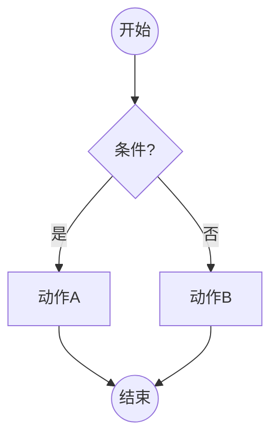
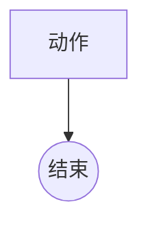

# kea flowchart-check 命令实现计划

> **For agentic workers:** REQUIRED SUB-SKILL: Use superpowers:subagent-driven-development (recommended) or superpowers:executing-plans to implement this plan task-by-task. Steps use checkbox (`- [ ]`) syntax for tracking.

**Goal:** 新增 `kea flowchart-check` 命令，对 Mermaid flowchart 文件执行 S1-S4 四项结构校验，输出结构化 JSON。

**Architecture:** 新增 `kea/validator/flowchart_checker.py` 封装 S1-S4 逻辑，复用已有 `mermaid_parser.py` 的解析结果；在 `kea/cli.py` 注册 `flowchart-check` 子命令；在 `tests/test_flowchart_checker.py` 覆盖各检查项的通过/失败场景。

**Tech Stack:** Python 3.11+，dataclasses，pytest；复用 `kea.parser.mermaid_parser`（MermaidFlowchart, NodeType, parse_mermaid, parse_file）。

---

## 文件变更清单

| 操作 | 文件 | 说明 |
|------|------|------|
| 新增 | `kea/validator/flowchart_checker.py` | FlowchartChecker 类，S1-S4 逻辑 |
| 新增 | `tests/test_flowchart_checker.py` | 单元测试 |
| 修改 | `kea/cli.py` | 注册 `flowchart-check` 子命令 |

---

## Task 1: FlowchartChecker 核心逻辑

**Files:**
- Create: `kea/validator/flowchart_checker.py`
- Test: `tests/test_flowchart_checker.py`

- [ ] **Step 1: 写 S1 失败测试**

```python
# tests/test_flowchart_checker.py
import pytest
from kea.parser.mermaid_parser import parse_mermaid
from kea.validator.flowchart_checker import FlowchartChecker, CheckIssue

def _check(mermaid_text: str) -> list[CheckIssue]:
    chart = parse_mermaid(mermaid_text)
    return FlowchartChecker().check(chart)

def test_s1_no_start_node():
    issues = _check("""
flowchart TD
  A[动作] --> B((结束))
""")
    checks = [i.check for i in issues]
    assert "S1" in checks

def test_s1_multiple_start_nodes():
    issues = _check("""
flowchart TD
  S1((开始)) --> A[动作]
  S2((开始)) --> B[动作]
  A --> E((结束))
  B --> E
""")
    checks = [i.check for i in issues]
    assert "S1" in checks

def test_s1_passes_with_one_start():
    issues = _check("""
flowchart TD
  S((开始)) --> A[动作] --> E((结束))
""")
    assert not any(i.check == "S1" for i in issues)
```

- [ ] **Step 2: 运行测试验证失败**

```bash
cd /Users/kenkangning/KEA-v3 && python3 -m pytest tests/test_flowchart_checker.py -v 2>&1 | head -20
```

期望：`ModuleNotFoundError: No module named 'kea.validator.flowchart_checker'`

- [ ] **Step 3: 实现 FlowchartChecker**

创建 `kea/validator/flowchart_checker.py`：

```python
"""Mermaid 流程图结构校验器 — S1-S4 四项确定性检查."""

from __future__ import annotations

from dataclasses import dataclass, field

from kea.parser.mermaid_parser import MermaidFlowchart, NodeType


@dataclass
class CheckIssue:
    check: str          # "S1" | "S2" | "S3" | "S4"
    node_id: str        # 问题节点 ID，全局问题时为 ""
    node_label: str     # 节点标签
    message: str        # 问题描述


@dataclass
class FlowchartCheckResult:
    file: str = ""
    passed: bool = True
    issues: list[CheckIssue] = field(default_factory=list)


class FlowchartChecker:
    """对单个 MermaidFlowchart 执行 S1-S4 结构校验."""

    def check(self, chart: MermaidFlowchart) -> list[CheckIssue]:
        issues: list[CheckIssue] = []
        issues.extend(self._check_s1(chart))
        issues.extend(self._check_s2(chart))
        issues.extend(self._check_s3(chart))
        issues.extend(self._check_s4(chart))
        return issues

    def _check_s1(self, chart: MermaidFlowchart) -> list[CheckIssue]:
        """S1: 有且仅有 1 个 START 节点."""
        starts = [n for n in chart.nodes if n.node_type == NodeType.START]
        if len(starts) == 0:
            return [CheckIssue("S1", "", "", "流程图缺少开始节点（START）")]
        if len(starts) > 1:
            ids = ", ".join(n.id for n in starts)
            return [CheckIssue("S1", ids, "", f"流程图有 {len(starts)} 个开始节点（需要唯一）：{ids}")]
        return []

    def _check_s2(self, chart: MermaidFlowchart) -> list[CheckIssue]:
        """S2: 至少有 1 个 END 节点."""
        ends = [n for n in chart.nodes if n.node_type == NodeType.END]
        if not ends:
            return [CheckIssue("S2", "", "", "流程图缺少结束节点（END）")]
        return []

    def _check_s3(self, chart: MermaidFlowchart) -> list[CheckIssue]:
        """S3: 每个 DECISION/SUB_DECISION 节点出路 >= 2."""
        issues: list[CheckIssue] = []
        branches = chart.decision_branches()
        for node_id, edges in branches.items():
            if len(edges) < 2:
                node = chart.get_node(node_id)
                label = node.label if node else node_id
                issues.append(CheckIssue(
                    "S3", node_id, label,
                    f"判断节点 \"{label}\" 只有 {len(edges)} 条出路（需要 >= 2）"
                ))
        return issues

    def _check_s4(self, chart: MermaidFlowchart) -> list[CheckIssue]:
        """S4: 无孤立节点（START 外所有节点有入路，END 外所有节点有出路）."""
        issues: list[CheckIssue] = []
        if not chart.nodes:
            return issues

        in_degrees: dict[str, int] = {n.id: 0 for n in chart.nodes}
        out_degrees: dict[str, int] = {n.id: 0 for n in chart.nodes}
        for edge in chart.edges:
            if edge.target in in_degrees:
                in_degrees[edge.target] += 1
            if edge.source in out_degrees:
                out_degrees[edge.source] += 1

        for node in chart.nodes:
            if node.node_type != NodeType.START and in_degrees[node.id] == 0:
                issues.append(CheckIssue(
                    "S4", node.id, node.label,
                    f"节点 \"{node.label}\" 无入路（孤立节点）"
                ))
            if node.node_type != NodeType.END and out_degrees[node.id] == 0:
                issues.append(CheckIssue(
                    "S4", node.id, node.label,
                    f"节点 \"{node.label}\" 无出路（死节点）"
                ))
        return issues
```

- [ ] **Step 4: 运行测试验证通过**

```bash
cd /Users/kenkangning/KEA-v3 && python3 -m pytest tests/test_flowchart_checker.py -v
```

期望：3 tests passed

- [ ] **Step 5: Commit**

```bash
git add kea/validator/flowchart_checker.py tests/test_flowchart_checker.py
git commit -m "feat: add FlowchartChecker with S1-S4 structural validation"
```

---

## Task 2: 补充 S2/S3/S4 测试

**Files:**
- Test: `tests/test_flowchart_checker.py`

- [ ] **Step 1: 追加 S2/S3/S4 测试**

在 `tests/test_flowchart_checker.py` 末尾追加：

```python
def test_s2_no_end_node():
    issues = _check("""
flowchart TD
  S((开始)) --> A[动作] --> B[动作2]
""")
    assert any(i.check == "S2" for i in issues)

def test_s2_passes_with_end():
    issues = _check("""
flowchart TD
  S((开始)) --> A[动作] --> E((结束))
""")
    assert not any(i.check == "S2" for i in issues)

def test_s3_decision_one_branch():
    issues = _check("""
flowchart TD
  S((开始)) --> D{条件?}
  D -->|是| A[动作]
  A --> E((结束))
""")
    assert any(i.check == "S3" for i in issues)

def test_s3_decision_two_branches():
    issues = _check("""
flowchart TD
  S((开始)) --> D{条件?}
  D -->|是| A[动作]
  D -->|否| B[其他]
  A --> E((结束))
  B --> E
""")
    assert not any(i.check == "S3" for i in issues)

def test_s4_isolated_node_no_input():
    issues = _check("""
flowchart TD
  S((开始)) --> A[动作] --> E((结束))
  B[孤立节点] --> E
""")
    assert any(i.check == "S4" and i.node_id == "B" for i in issues)

def test_s4_dead_node_no_output():
    issues = _check("""
flowchart TD
  S((开始)) --> A[动作]
  A --> B[死节点]
  A --> E((结束))
""")
    assert any(i.check == "S4" and i.node_id == "B" for i in issues)

def test_s4_start_allowed_no_input():
    """START 节点无入路是合法的."""
    issues = _check("""
flowchart TD
  S((开始)) --> A[动作] --> E((结束))
""")
    assert not any(i.check == "S4" and i.node_id == "S" for i in issues)

def test_s4_end_allowed_no_output():
    """END 节点无出路是合法的."""
    issues = _check("""
flowchart TD
  S((开始)) --> A[动作] --> E((结束))
""")
    assert not any(i.check == "S4" and i.node_id == "E" for i in issues)

def test_clean_flowchart_no_issues():
    """标准合规流程图无任何 issue."""
    issues = _check("""
flowchart TD
  S((开始)) --> D{条件?}
  D -->|是| A[动作A]
  D -->|否| B[动作B]
  A --> E((结束))
  B --> E
""")
    assert issues == []
```

- [ ] **Step 2: 运行全部测试**

```bash
cd /Users/kenkangning/KEA-v3 && python3 -m pytest tests/test_flowchart_checker.py -v
```

期望：12 tests passed

- [ ] **Step 3: Commit**

```bash
git add tests/test_flowchart_checker.py
git commit -m "test: add S2/S3/S4 coverage and clean flowchart baseline for flowchart_checker"
```

---

## Task 3: CLI 命令注册

**Files:**
- Modify: `kea/cli.py`

- [ ] **Step 1: 在 cli.py 顶部 import 新增**

在 `kea/cli.py` 已有 import 块末尾（`from kea.ingester import ingest as run_ingest` 之后），新增：

```python
from kea.validator.flowchart_checker import FlowchartChecker, FlowchartCheckResult
from kea.parser.mermaid_parser import parse_file as parse_mermaid_file_fc
```

注意：`parse_mermaid_file` 已被 import，此处用别名 `parse_mermaid_file_fc` 避免冲突。实际检查后若已有同名 import，直接复用。

- [ ] **Step 2: 实现 cmd_flowchart_check 函数**

在 `cmd_lint` 函数之前（约 `# lint` 注释处之前）插入：

```python
# ---------------------------------------------------------------------------
# flowchart-check
# ---------------------------------------------------------------------------

def cmd_flowchart_check(args: argparse.Namespace) -> int:
    """Mermaid 流程图 S1-S4 结构校验."""
    from kea.parser.mermaid_parser import parse_file as _parse_fc
    from kea.validator.flowchart_checker import FlowchartChecker, FlowchartCheckResult
    import glob as _glob

    target = Path(args.target)
    checker = FlowchartChecker()

    # 收集目标文件
    if target.is_dir():
        files = sorted(target.glob("*.md"))
    elif target.is_file():
        files = [target]
    else:
        if args.format == "json":
            _json_out({"error": f"目标不存在：{target}"})
        else:
            print(f"错误：目标不存在：{target}", file=sys.stderr)
        return 1

    results: list[dict] = []
    total_passed = 0
    total_failed = 0

    for f in files:
        try:
            chart = _parse_fc(str(f))
        except Exception as e:
            results.append({
                "file": f.name,
                "passed": False,
                "issues": [{"check": "PARSE", "node_id": "", "node_label": "", "message": f"解析失败：{e}"}],
            })
            total_failed += 1
            continue

        issues = checker.check(chart)
        passed = len(issues) == 0
        if passed:
            total_passed += 1
        else:
            total_failed += 1
        results.append({
            "file": f.name,
            "passed": passed,
            "issues": [
                {"check": i.check, "node_id": i.node_id, "node_label": i.node_label, "message": i.message}
                for i in issues
            ],
        })

    summary = {"total": len(files), "passed": total_passed, "failed": total_failed}

    if args.format == "json":
        _json_out({"command": "flowchart-check", "summary": summary, "results": results})
    else:
        print(f"\n流程图结构校验（S1-S4）")
        print(f"总计：{len(files)} 个，通过：{total_passed}，失败：{total_failed}\n")
        for r in results:
            icon = "✅" if r["passed"] else "❌"
            print(f"  {icon} {r['file']}")
            for issue in r["issues"]:
                print(f"       [{issue['check']}] {issue['message']}")
        print()

    return 0 if total_failed == 0 else 1
```

- [ ] **Step 3: 注册子命令**

在 `main()` 函数中，`# lint` 子命令注册之前，插入：

```python
    # flowchart-check
    fc_check_parser = subparsers.add_parser("flowchart-check", help="Mermaid 流程图 S1-S4 结构校验")
    fc_check_parser.add_argument("target", help="目标 .md 文件或目录")
    fc_check_parser.set_defaults(func=cmd_flowchart_check)
```

- [ ] **Step 4: 验证命令可执行**

```bash
cd /Users/kenkangning/KEA-v3 && python3 -m kea flowchart-check --help
```

期望输出包含：`Mermaid 流程图 S1-S4 结构校验`

- [ ] **Step 5: 运行全部测试确认无回归**

```bash
cd /Users/kenkangning/KEA-v3 && python3 -m pytest tests/test_flowchart_checker.py tests/test_validator.py tests/test_parser.py -v
```

期望：全部 passed，无 failure。

- [ ] **Step 6: Commit**

```bash
git add kea/cli.py
git commit -m "feat: register flowchart-check CLI command with S1-S4 json output"
```

---

## Task 4: 集成测试（命令行 JSON 输出格式）

**Files:**
- Test: `tests/test_flowchart_checker.py`

- [ ] **Step 1: 追加 CLI JSON 输出格式测试**

在 `tests/test_flowchart_checker.py` 末尾追加：

```python
import subprocess, json as _json, tempfile, os

def test_cli_json_output_clean(tmp_path):
    """CLI 输出合规流程图时 summary.failed == 0."""
    md = tmp_path / "流程.md"
    md.write_text("""---
domain: test
process: 流程
phase: flowchart
created_at: 2026-04-28
---

""")
    result = subprocess.run(
        ["python3", "-m", "kea", "--format", "json", "flowchart-check", str(tmp_path)],
        capture_output=True, text=True,
        cwd="/Users/kenkangning/KEA-v3"
    )
    data = _json.loads(result.stdout)
    assert data["summary"]["failed"] == 0
    assert data["results"][0]["passed"] is True

def test_cli_json_output_with_issue(tmp_path):
    """CLI 输出含问题流程图时 summary.failed == 1，issues 非空。"""
    md = tmp_path / "有问题.md"
    md.write_text("""---
domain: test
process: 有问题
phase: flowchart
created_at: 2026-04-28
---

""")
    result = subprocess.run(
        ["python3", "-m", "kea", "--format", "json", "flowchart-check", str(tmp_path)],
        capture_output=True, text=True,
        cwd="/Users/kenkangning/KEA-v3"
    )
    data = _json.loads(result.stdout)
    assert data["summary"]["failed"] == 1
    checks = [i["check"] for i in data["results"][0]["issues"]]
    assert "S1" in checks  # 缺 START 节点
```

- [ ] **Step 2: 运行集成测试**

```bash
cd /Users/kenkangning/KEA-v3 && python3 -m pytest tests/test_flowchart_checker.py -v -k "cli"
```

期望：2 tests passed

- [ ] **Step 3: 运行全套测试**

```bash
cd /Users/kenkangning/KEA-v3 && python3 -m pytest tests/ -v
```

期望：全部 passed。

- [ ] **Step 4: Commit**

```bash
git add tests/test_flowchart_checker.py
git commit -m "test: add CLI integration tests for flowchart-check json output"
```
