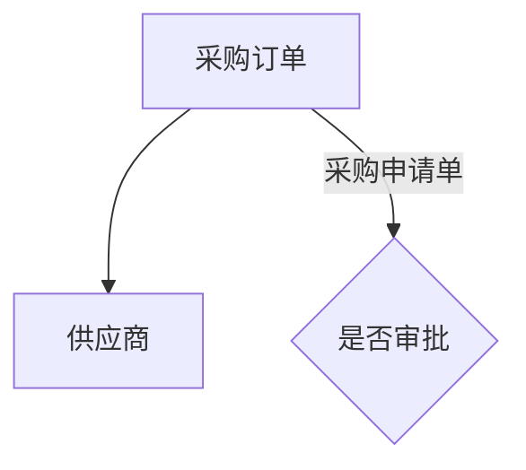
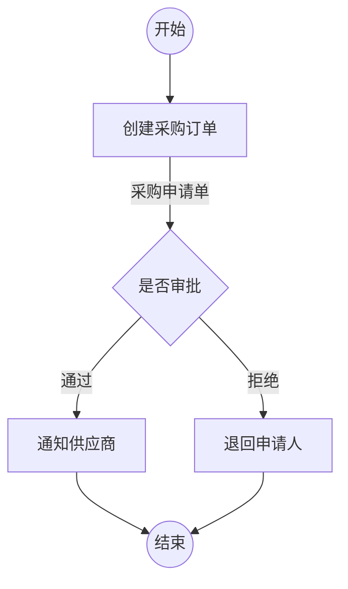

# Phase 5 Flowchart Candidates Implementation Plan

> **For agentic workers:** REQUIRED SUB-SKILL: Use superpowers:subagent-driven-development (recommended) or superpowers:executing-plans to implement this plan task-by-task. Steps use checkbox (`- [ ]`) syntax for tracking.

**Goal:** 修复 `kea mermaid` 对 `.md` 文件的解析支持，并改造 Phase 5 在 Dispatch 前先用工具扫描流程图候选，subagent 消费结构化候选而非自己读文件。

**Architecture:** 工具层（`mermaid_parser.py` + `cli.py`）修复 `.md` 解析和目录 glob；Phase 5 新增 Step 2.5 调用工具取候选 JSON；extract-objects SKILL.md 移除 DIAGRAMS_DIR、消费 FLOWCHART_CANDIDATES。

**Tech Stack:** Python 3, pytest, Markdown, Mermaid, AgentFile SKILL.md

---

## File Map

| 文件 | 改动类型 | 职责 |
|---|---|---|
| `kea/parser/mermaid_parser.py` | Modify | 修复 `parse_file`：正确提取 `.md` 内嵌 Mermaid 代码块 |
| `kea/cli.py` | Modify | `cmd_mermaid` 目录模式改为 glob `*.md` |
| `tests/test_mermaid_parser.py` | Create | `parse_file` 对 `.md` 文件和目录模式的测试 |
| `AgentFile/phases/phase-5-extract-objects.md` | Modify | 新增 Step 2.5；Step 3 Dispatch prompt 替换参数 |
| `AgentFile/skills/extract-objects/SKILL.md` | Modify | Inputs 表更新；Step 1 重写；新增置信度分级指引 |

---

## Task 1：修复 `parse_file` 对 `.md` 的处理

**Files:**
- Modify: `kea/parser/mermaid_parser.py:227-232`
- Create: `tests/test_mermaid_parser.py`

- [ ] **Step 1: 写失败测试**

新建 `tests/test_mermaid_parser.py`：

```python
"""mermaid_parser.parse_file 单元测试."""
import tempfile
import os
from pathlib import Path
from kea.parser.mermaid_parser import parse_file, NodeType


class TestParseFileMd:
    def test_md_with_frontmatter_and_mermaid_block(self, tmp_path):
        """含 YAML front matter 的 .md 文件，应正确提取 Mermaid 代码块。"""
        f = tmp_path / "flowchart.md"
        f.write_text(
            "---\ntitle: 测试流程图\n---\n\n# 标题\n\n```mermaid\nflowchart TD\n"
            "  A[采购订单] --> B[供应商]\n```\n",
            encoding="utf-8",
        )
        chart = parse_file(str(f))
        labels = {n.label for n in chart.nodes}
        assert "采购订单" in labels
        assert "供应商" in labels

    def test_md_without_mermaid_block_falls_back(self, tmp_path):
        """不含 Mermaid 代码块的 .md 文件，整体视为 Mermaid 语法（兼容纯流程图文件）。"""
        f = tmp_path / "plain.md"
        f.write_text("flowchart TD\n  A[节点A] --> B[节点B]\n", encoding="utf-8")
        chart = parse_file(str(f))
        labels = {n.label for n in chart.nodes}
        assert "节点A" in labels

    def test_pure_mermaid_file(self, tmp_path):
        """.mermaid 纯文件仍可正常解析。"""
        f = tmp_path / "flow.mermaid"
        f.write_text("flowchart TD\n  X[订单] --> Y[审批]\n", encoding="utf-8")
        chart = parse_file(str(f))
        assert any(n.label == "订单" for n in chart.nodes)
```

- [ ] **Step 2: 运行测试，确认失败**

```bash
cd /Users/kenkangning/KEA-v3
python3 -m pytest tests/test_mermaid_parser.py -v 2>&1 | head -30
```

期望：`FAILED` — `test_md_with_frontmatter_and_mermaid_block`（front matter 污染导致解析结果里没有"采购订单"）

- [ ] **Step 3: 修复 `parse_file`**

编辑 `kea/parser/mermaid_parser.py`，将 `parse_file` 函数替换为：

```python
def parse_file(path: str) -> MermaidFlowchart:
    with open(path, encoding="utf-8") as f:
        content = f.read()
    m = re.search(r'```mermaid\s*\n(.*?)```', content, re.DOTALL)
    if m:
        content = m.group(1)
    return parse_mermaid(content)
```

- [ ] **Step 4: 运行测试，确认通过**

```bash
python3 -m pytest tests/test_mermaid_parser.py -v 2>&1
```

期望：3 个测试全部 `PASSED`

- [ ] **Step 5: 回归已有测试**

```bash
python3 -m pytest tests/test_flowchart_checker.py -v 2>&1
```

期望：全部 `PASSED`（flowchart_checker 也用 parse_file，确保无回归）

- [ ] **Step 6: Commit**

```bash
git add kea/parser/mermaid_parser.py tests/test_mermaid_parser.py
git commit -m "fix: parse_file correctly extracts mermaid block from .md files with frontmatter"
```

---

## Task 2：修复 `cmd_mermaid` 目录模式 glob

**Files:**
- Modify: `kea/cli.py:370`
- Modify: `tests/test_mermaid_parser.py`（新增目录模式测试）

- [ ] **Step 1: 新增失败测试**

在 `tests/test_mermaid_parser.py` 末尾追加：

```python
class TestCmdMermaidDir:
    def test_directory_mode_scans_md_files(self, tmp_path):
        """目录模式应 glob *.md 文件，不只扫描 *.mermaid。"""
        f = tmp_path / "流程.md"
        f.write_text(
            "```mermaid\nflowchart TD\n  A[库存] --> B[出库单]\n```\n",
            encoding="utf-8",
        )
        # 直接调用 cli 逻辑：glob *.md
        from pathlib import Path
        from kea.parser.mermaid_parser import parse_file
        files = sorted(Path(tmp_path).glob("*.md"))
        assert len(files) == 1
        chart = parse_file(str(files[0]))
        labels = {n.label for n in chart.nodes}
        assert "库存" in labels
        assert "出库单" in labels
```

- [ ] **Step 2: 确认测试现在通过（glob 逻辑本身无 bug，只是 cli.py 还用旧 glob）**

```bash
python3 -m pytest tests/test_mermaid_parser.py::TestCmdMermaidDir -v
```

期望：`PASSED`（测试针对底层逻辑，下一步验证 CLI 端到端）

- [ ] **Step 3: 修改 `cmd_mermaid` 的 glob**

编辑 `kea/cli.py` 第 370 行，将：

```python
        for f in sorted(target.glob("*.mermaid")):
```

改为：

```python
        for f in sorted(target.glob("*.md")):
```

- [ ] **Step 4: 端到端验证 CLI 目录模式**

```bash
# 先建临时目录测试
mkdir -p /tmp/kea_test_diagrams
cat > /tmp/kea_test_diagrams/测试流程.md << 'EOF'

EOF
python3 -m kea --format json mermaid /tmp/kea_test_diagrams/
```

期望：JSON 输出中 `count: 1`，`nodes` 含 `采购订单`、`供应商`，`edges[0].label` = `采购申请单`

- [ ] **Step 5: 全量回归**

```bash
python3 -m pytest tests/ -v 2>&1 | tail -20
```

期望：全部 `PASSED`

- [ ] **Step 6: Commit**

```bash
git add kea/cli.py tests/test_mermaid_parser.py
git commit -m "fix: cmd_mermaid directory mode globs *.md instead of *.mermaid"
```

---

## Task 3：Phase 5 新增 Step 2.5

**Files:**
- Modify: `AgentFile/phases/phase-5-extract-objects.md`

- [ ] **Step 1: 在 Step 2 和 Step 3 之间插入 Step 2.5**

在 `### Step 2: 更新 chain-state.md 为 in_progress` 之后、`### Step 3: Dispatch 对象提取 Agent` 之前，插入以下内容：

```markdown
### Step 2.5: 扫描流程图候选

执行工具扫描：

```bash
python3 -m kea --format json mermaid {DIAGRAMS_DIR}
```

**成功**（`count > 0`）→ 从 JSON 输出构建 `FLOWCHART_CANDIDATES` 文本：

```
流程图扫描结果（{count} 个文件，{总节点数} 个节点，{总边数} 条边）：

文件：{chart.file}
  节点：{label}[{type}], {label}[{type}] ...
  边标签：{edge.label}, {edge.label} ...（仅非空 label）

文件：...
```

**失败**（`count = 0` 或命令报错）→ 展示错误详情，询问用户：
- A 检查 DIAGRAMS_DIR 路径后重试
- B 跳过工具扫描（fallback：Step 3 仍传 `DIAGRAMS_DIR`，subagent 自行读文件）
```

- [ ] **Step 2: 修改 Step 3 的 Dispatch 参数**

将 Step 3 的 Dispatch 块：

```
DIAGRAMS_DIR: {DIAGRAMS_DIR}
SUMMARY_PATHS: {RESEARCH_REPORT_PATH},{INTERVIEW_SUMMARY_PATH}
OBJECTS_DIR: {VAULT_PATH}/30-Ontology/objects/{DOMAIN_EN}/
EXISTING_FILES: {EXISTING_FILES（MODE=incremental 时）}
```

改为：

```
FLOWCHART_CANDIDATES: {Step 2.5 生成的候选摘要文本}
SUMMARY_PATHS: {RESEARCH_REPORT_PATH},{INTERVIEW_SUMMARY_PATH}
OBJECTS_DIR: {VAULT_PATH}/30-Ontology/objects/{DOMAIN_EN}/
EXISTING_FILES: {EXISTING_FILES（MODE=incremental 时）}
```

- [ ] **Step 3: 更新输入参数表**

将文件顶部参数表中的 `DIAGRAMS_DIR` 行说明更新为：

```markdown
| `DIAGRAMS_DIR` | G3/G4 已校验流程图目录（Step 2.5 由工具扫描，结果以 FLOWCHART_CANDIDATES 形式传入 subagent） |
```

- [ ] **Step 4: Commit**

```bash
git add AgentFile/phases/phase-5-extract-objects.md
git commit -m "feat: phase-5 add step 2.5 kea mermaid scan before subagent dispatch"
```

---

## Task 4：extract-objects SKILL.md 改造

**Files:**
- Modify: `AgentFile/skills/extract-objects/SKILL.md`

- [ ] **Step 1: 更新 Inputs 表**

将 `## Inputs` 下的 `Source Documents` 表：

```markdown
| `DIAGRAMS_DIR` | **Yes** | **Primary source**. Directory containing validated Mermaid flowcharts ... |
| `SUMMARY_PATHS` | **Yes** | Supplementary source. ... |
| `REPORT_PATHS` | No | Additional context files for detail. |
```

替换为：

```markdown
| `FLOWCHART_CANDIDATES` | **Yes** | **Primary source**. Structured candidate text generated by Phase 5 via `kea mermaid`. Contains node labels (with type), edge labels grouped by file. |
| `SUMMARY_PATHS` | **Yes** | Supplementary source. Research reports and interview summaries for attribute detail, business descriptions, and relationship context. |
```

同时删除文中 `**Source priority**: \`DIAGRAMS_DIR\` > ...` 一行，改为：

```markdown
**Source priority**: `FLOWCHART_CANDIDATES` > `SUMMARY_PATHS`
```

- [ ] **Step 2: 重写 Step 1**

将 `## Step 1: Read inputs` 整节替换为：

```markdown
## Step 1: Read inputs

Read `FLOWCHART_CANDIDATES` — structured candidate text generated by Phase 5 using `kea mermaid`. It is grouped by source file and contains node labels (with type) and edge labels.

Then read all files in `SUMMARY_PATHS` (research reports, interview summaries) for supplementary detail — attribute descriptions, business context, relationship explanations that flowcharts don't capture.

**Do NOT read files from DIAGRAMS_DIR** — the tool has already done that. Consuming `FLOWCHART_CANDIDATES` directly avoids re-parsing Mermaid syntax and keeps your role focused on semantic judgment.

Identify candidate business objects using the following confidence tiers:

| Candidate source | Confidence | Action |
|---|---|---|
| Edge labels | High | List directly as candidates |
| `subprocess` node labels | Medium-high | Strip verb prefix if present, list as candidates |
| Noun parts of `action` node labels | Medium | Extract noun, exclude verb component |
| `decision` node labels | Low | Only include if label clearly names a data entity |

If multiple sources mention the same object, consolidate using the most detailed description. When `FLOWCHART_CANDIDATES` and `SUMMARY_PATHS` conflict on object names, `FLOWCHART_CANDIDATES` wins (expert-validated flowcharts are authoritative).

Read `~/.claude/skills/kea/templates/object-template.md` to understand the required output format.
```

- [ ] **Step 3: 删除旧的文件读取说明**

检查 Step 1 是否还有遗留的 `DIAGRAMS_DIR` 相关描述（如 "Read all Mermaid flowchart files in DIAGRAMS_DIR"），如有删除。

- [ ] **Step 4: Commit**

```bash
git add AgentFile/skills/extract-objects/SKILL.md
git commit -m "feat: extract-objects skill consumes FLOWCHART_CANDIDATES instead of reading DIAGRAMS_DIR"
```

---

## Task 5：全量验证

- [ ] **Step 1: 运行全部测试**

```bash
cd /Users/kenkangning/KEA-v3
python3 -m pytest tests/ -v 2>&1
```

期望：所有测试 `PASSED`，无新增失败

- [ ] **Step 2: 验证 lint 无新增错误**

```bash
python3 -m kea --format json lint AgentFile/ 2>&1 | python3 -c "import sys,json; d=json.load(sys.stdin); print('errors:', d.get('summary',{}).get('errors',0))"
```

期望：`errors: 0`

- [ ] **Step 3: 手动验证 mermaid 命令端到端**

```bash
# 清理临时目录
rm -rf /tmp/kea_test_diagrams

# 建含 frontmatter 的测试文件
mkdir -p /tmp/kea_test_diagrams
cat > /tmp/kea_test_diagrams/创建采购订单.md << 'EOF'
---
title: 创建采购订单流程
---

# 创建采购订单


EOF

python3 -m kea --format json mermaid /tmp/kea_test_diagrams/
```

期望输出关键字段：
- `count: 1`
- nodes 中含 label=`采购订单`（type=action）
- edges 中含 label=`采购申请单`

- [ ] **Step 4: Final commit（如有未提交改动）**

```bash
git status
# 确认无未提交文件
```
