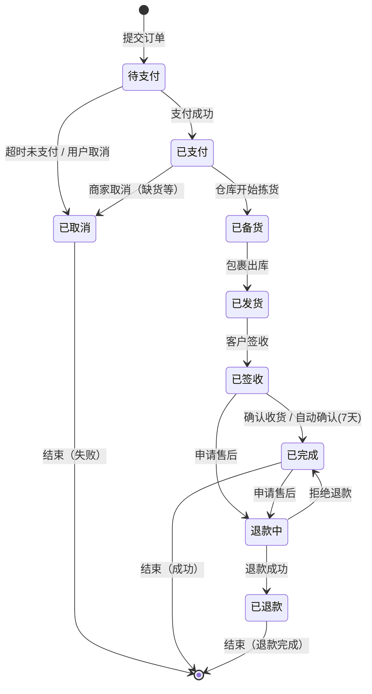
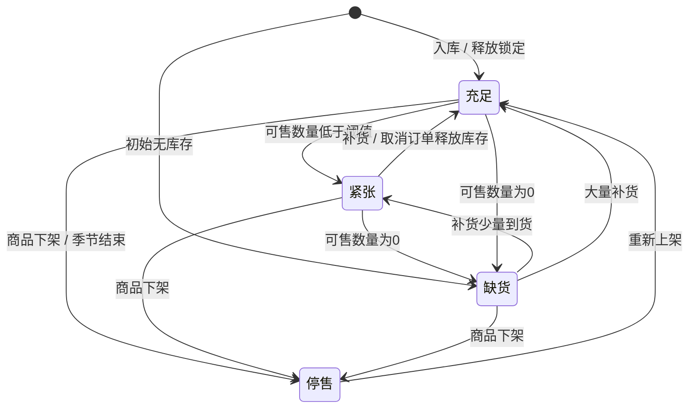

# 通用知识文档格式样例集

> 本文档基于「电商订单履约」通用业务场景，展示 Object / Logic / Action / Rule 四类知识文档的 Agent-Native Markdown 格式规范。  
> 选择电商场景的原因：概念普适（订单、商品、库存、用户），状态流转清晰，计算逻辑丰富，便于跨行业读者理解格式本身而不被业务术语干扰。  
> 本文档本身不是知识文档，而是格式规范参考模板。

---

## 目录

1. [Object 样例：订单](#1-object-样例订单)
2. [Object 样例：商品库存](#2-object-样例商品库存)
3. [Logic 样例：订单创建流程](#3-logic-样例订单创建流程)
4. [Action 样例：订单价格计算](#4-action-样例订单价格计算)
5. [Action 样例：库存锁定与释放](#5-action-样例库存锁定与释放)
6. [Rule 样例集](#6-rule-样例集)
7. [附录：四类文档格式对比速查](#7-附录四类文档格式对比速查)

---

## 1. Object 样例：订单

```markdown
---
type: object
id: sales_order
name: 订单
aliases: [销售订单, 客户订单, Order]
english_name: SalesOrder

agent_context:
  one_liner: "客户购买行为的载体单据，贯穿支付、履约、售后全生命周期，是电商系统的核心交易对象"
  
  typical_scenarios:
    - "用户问：我的订单到哪了？"
    - "查询订单当前状态和历史流转记录"
    - "计算订单的实付金额和优惠明细"
    - "客服处理订单退款或取消请求"
  
  common_misconceptions:
    - "订单 ≠ 购物车：购物车是意向集合，订单是已确认的购买契约"
    - "订单状态'已支付'不等于'已发货'，中间可能有备货、拣货、打包等履约环节"
    - "订单取消后库存自动释放，但优惠券不一定自动返还（取决于券规则）"
    - "部分退款后订单状态仍为'已完成'，只是金额减少"
  
  related_importance:
    订单明细: critical      # 订单的核心内容
    用户: critical          # 订单归属
    商品: high              # 购买的标的物
    商品库存: high           # 履约依赖
    物流单: medium          # 发货后的追踪
    支付流水: critical       # 资金凭证
    优惠券: medium          # 优惠来源

relations:
  - target: order_item
    type: contains
    cardinality: "1:N"
    description: 一个订单包含一个或多个订单明细（SKU级别）
  
  - target: user
    type: belongs_to
    cardinality: "N:1"
    description: 每个订单归属于一个用户
  
  - target: product
    type: references
    cardinality: "N:M"
    description: 订单通过订单明细间接引用商品
  
  - target: inventory
    type: depends_on
    cardinality: "N:M"
    description: 订单履约依赖商品库存的可用性
  
  - target: payment_record
    type: has
    cardinality: "1:N"
    description: 一个订单对应一笔或多笔支付流水（含部分退款）
  
  - target: shipment
    type: has
    cardinality: "1:N"
    description: 一个订单可拆分为多个包裹发货
  
  - target: coupon
    type: uses
    cardinality: "N:M"
    description: 订单可使用多张优惠券（受叠加规则约束）
---

# 对象描述

订单是客户提交购买意向后生成的正式交易单据，具有法律约束力。订单记录了购买的商品、数量、价格、收货地址、支付方式等关键信息，并随着履约流程在各状态间流转。

## 属性清单

| 名称 | 英文名 | 描述 | 主键 | 类型 | 约束 |
| --- | --- | --- | --- | --- | --- |
| 订单编号 | OrderNo | 全局唯一订单标识 | 是 | 字符串 | {pattern: "^ORD[0-9]{14}$", max_length: 17, unique: true} |
| 用户编号 | UserID | 下单用户 | 否 | 对象引用 | {target: user, required: true} |
| 订单状态 | Status | 订单生命周期状态 | 否 | 枚举 | {values: [待支付, 已支付, 已备货, 已发货, 已签收, 已完成, 已取消, 退款中, 已退款], required: true} |
| 订单金额 | OrderAmount | 商品原价合计 | 否 | 金额 | {min: 0, precision: 2, required: true} |
| 实付金额 | PaidAmount | 用户实际支付金额 | 否 | 金额 | {min: 0, precision: 2, required: true} |
| 优惠金额 | DiscountAmount | 优惠券/活动减免合计 | 否 | 金额 | {min: 0, precision: 2, default: 0} |
| 运费 | ShippingFee | 物流费用 | 否 | 金额 | {min: 0, precision: 2, default: 0} |
| 收货地址 | ShippingAddress | 结构化收货地址 | 否 | 对象 | {required: true, schema: {province: string, city: string, district: string, detail: string, phone: string}} |
| 创建时间 | CreateTime | 订单生成时间 | 否 | 时间戳 | {required: true, immutable: true} |
| 支付截止时间 | PayDeadline | 超时未支付则自动取消 | 否 | 时间戳 | {required: true} |

## 状态机



## 状态转换规则

| 转换 | 触发条件 | 前置条件 | 执行动作 |
|------|---------|---------|---------|
| 待支付 → 已支付 | 支付回调成功 | 订单未超时、金额匹配 | 更新状态、记录支付流水、锁定库存转为正式扣减 |
| 待支付 → 已取消 | 超时（PayDeadline到达）或用户主动取消 | 状态必须为"待支付" | 更新状态、释放库存锁定、返还优惠券 |
| 已支付 → 已备货 | 仓库系统接单 | 库存充足 | 更新状态、生成拣货单 |
| 已支付 → 已取消 | 商家取消（缺货/违禁） | 尚未发货 | 更新状态、全额退款、释放库存 |
| 已发货 → 已签收 | 物流签收回调 | 包裹在途 | 更新状态、触达用户通知 |
| 已签收 → 已完成 | 用户确认或7天自动确认 | 无未处理售后 | 更新状态、触发积分发放 |
| 已签收/已完成 → 退款中 | 用户申请退款/退货 | 在售后时效内 | 更新状态、冻结退款金额 |
| 退款中 → 已退款 | 退款审核通过 | - | 更新状态、执行退款、返还库存（退货时） |
| 退款中 → 已完成 | 退款审核拒绝 | - | 状态回退为"已完成" |

## 业务规则

- **R-ORDER-001**: 状态 = "已支付" 后，收货地址不可修改（如需修改需走售后流程）
- **R-ORDER-002**: 实付金额 = 订单金额 - 优惠金额 + 运费，且必须 ≥ 0
- **R-ORDER-003**: 订单编号全局唯一，格式为 "ORD" + YYYYMMDDHHMMSS + 2位序号
- **R-ORDER-004**: 从"待支付"到"已取消"的超时时间默认为 30 分钟，可配置
- **R-ORDER-005**: 订单金额变更（如部分退款）时，必须同步更新实付金额，并生成金额变更记录

## 关联对象

- 当前对象 contains → [[订单明细]]
- 当前对象 belongs_to → [[用户]]
- 当前对象 has → [[支付流水]]
- 当前对象 has → [[物流单]]
- 当前对象 uses → [[优惠券]]
```

---

## 2. Object 样例：商品库存

```markdown
---
type: object
id: inventory
name: 商品库存
aliases: [库存, SKU库存]
english_name: ProductInventory

agent_context:
  one_liner: "SKU级别可售与预留数量的实时快照，是订单能否成交和履约的核心判断依据"
  
  typical_scenarios:
    - "查询某SKU当前可售数量"
    - "判断用户下单时库存是否充足"
    - "计算大促期间的库存预警"
    - "追踪库存锁定与释放的流水"
  
  common_misconceptions:
    - "库存数量 ≠ 可售数量：可售数量 = 库存数量 - 锁定数量 - 预留数量"
    - "库存为0时商品不一定下架，可能处于'补货中'状态仍可展示"
    - "订单取消后库存不会立即加回，而是以'释放'流水形式异步恢复"
    - "多仓模式下库存是聚合值，实际扣减发生在具体仓库"
  
  related_importance:
    商品SKU: critical        # 库存归属
    订单: high               # 库存的消耗方
    仓库: high               # 库存的物理位置
    库存流水: medium         # 变动记录

relations:
  - target: product_sku
    type: belongs_to
    cardinality: "N:1"
    description: 每条库存记录归属于一个SKU
  
  - target: order
    type: consumed_by
    cardinality: "1:N"
    description: 库存被订单消耗（锁定或扣减）
  
  - target: warehouse
    type: located_at
    cardinality: "N:1"
    description: 库存位于特定仓库
  
  - target: inventory_transaction
    type: logs
    cardinality: "1:N"
    description: 库存变动产生流水记录
---

# 对象描述

商品库存是 SKU 级别可售与预留数量的实时快照。库存管理的核心挑战是在高并发场景下保证"超卖"不发生，同时最大化库存周转效率。库存状态反映的是业务可用性，而非单纯的物理数量。

## 属性清单

| 名称 | 英文名 | 描述 | 主键 | 类型 | 约束 |
| --- | --- | --- | --- | --- | --- |
| 库存记录编号 | InventoryID | 全局唯一 | 是 | 字符串 | {pattern: "^INV[0-9]{10}$", unique: true} |
| SKU编号 | SKUID | 关联的SKU | 否 | 对象引用 | {target: product_sku, required: true} |
| 仓库编号 | WarehouseID | 库存所在仓库 | 否 | 对象引用 | {target: warehouse, required: true} |
| 库存数量 | StockQty | 物理库存总量 | 否 | 整数 | {min: 0, required: true} |
| 锁定数量 | LockedQty | 被订单锁定但未扣减 | 否 | 整数 | {min: 0, default: 0} |
| 预留数量 | ReservedQty | 为活动/预售预留 | 否 | 整数 | {min: 0, default: 0} |
| 可售数量 | AvailableQty | 当前可销售数量 | 否 | 整数 | {computed: "StockQty - LockedQty - ReservedQty", min: 0} |
| 库存状态 | StockStatus | 库存业务状态 | 否 | 枚举 | {values: [充足, 紧张, 缺货, 停售], required: true} |
| 最后更新时间 | LastUpdateTime | 库存变动时间 | 否 | 时间戳 | {required: true} |

## 状态机



## 业务规则

- **R-INV-001**: 可售数量 = 库存数量 - 锁定数量 - 预留数量，必须 ≥ 0
- **R-INV-002**: 库存数量 < 锁定数量 + 预留数量 时，触发数据异常告警（不应发生）
- **R-INV-003**: 库存状态自动判定：可售数量 = 0 → 缺货；0 < 可售数量 < 安全库存 → 紧张；可售数量 ≥ 安全库存 → 充足
- **R-INV-004**: 同一 SKU + 仓库 组合只能有一条库存记录
- **R-INV-005**: 库存变动必须通过事务记录（增/减/锁定/释放/预留），不允许直接修改 StockQty

## 关联对象

- 当前对象 belongs_to → [[商品SKU]]
- 当前对象 located_at → [[仓库]]
- 当前对象 consumed_by → [[订单]]
- 当前对象 logs → [[库存流水]]
```

---

## 3. Logic 样例：订单创建流程

```markdown
---
type: logic
id: create_order
name: 订单创建流程
aliases: [下单流程, 提交订单]

agent_context:
  one_liner: "将购物车商品转化为正式订单的完整流程，覆盖库存校验、价格计算、优惠券核销、库存锁定、订单落库"
  
  typical_scenarios:
    - "用户点击'提交订单'后的后台处理"
    - "用户问：为什么我这个订单下不了？"
    - "大促期间库存紧张时的下单处理"
  
  common_misconceptions:
    - "点击'提交订单'不等于下单成功：中间有库存校验、价格计算等多个环节可能失败"
    - "优惠券核销和库存锁定是原子操作：要么都成功，要么都回滚"
    - "订单创建失败时购物车商品不会被清空"
    - "订单金额计算是在创建时完成的，后续商品价格变动不影响已创建订单"

relations:
  - target: user
    type: uses
    cardinality: "N:1"
    description: 校验用户状态和收货地址
  
  - target: product_sku
    type: uses
    cardinality: "N:M"
    description: 校验商品状态和SKU有效性
  
  - target: inventory
    type: uses
    cardinality: "N:M"
    description: 校验库存是否充足
  
  - target: coupon
    type: uses
    cardinality: "N:M"
    description: 校验优惠券可用性
  
  - target: calculate_order_price
    type: calls
    cardinality: "1:1"
    description: 计算订单最终价格
  
  - target: lock_inventory
    type: calls
    cardinality: "1:N"
    description: 锁定订单涉及的SKU库存

inputs:
  - name: user_id
    type: string
    required: true
    description: 下单用户编号
  - name: cart_items
    type: array
    required: true
    description: 购物车商品列表
    schema:
      - name: sku_id
        type: string
      - name: quantity
        type: integer
        min: 1
  - name: shipping_address
    type: object
    required: true
    description: 收货地址
  - name: coupon_ids
    type: array
    required: false
    description: 使用的优惠券编号列表

outputs:
  - name: order
    type: object
    description: 创建成功的订单对象
    schema:
      - name: order_no
        type: string
      - name: status
        type: string
      - name: order_amount
        type: number
      - name: paid_amount
        type: number
      - name: pay_deadline
        type: timestamp
  - name: payment_url
    type: string
    description: 支付跳转链接（如选择在线支付）
---

# 业务描述

订单创建流程是电商交易的核心入口，将用户的购物车意向转化为具有法律约束力的正式订单。流程需要保证：库存足够、价格准确、优惠合法、数据一致。任何环节失败都应完整回滚，不产生脏数据。

## 输入输出

### 输入

| 参数名称 | 参数类型 | 多值 | 描述 | 示例 |
|------|------|------|------|------|
| 用户编号 | 字符串 | 否 | 下单用户 | U123456 |
| 购物车商品 | 结构化数组 | 是 | SKU编号和购买数量 | [{sku_id: "SKU001", quantity: 2}] |
| 收货地址 | 对象 | 否 | 省市区+详细地址+手机号 | {province: "浙江", city: "杭州", ...} |
| 优惠券编号 | 字符串数组 | 是 | 使用的优惠券 | ["COUPON001", "COUPON002"] |

### 输出

| 参数名称 | 参数类型 | 描述 |
|------|------|------|
| 订单对象 | 对象 | 包含订单编号、状态、金额、支付截止时间 |
| 支付链接 | 字符串 | 在线支付的跳转URL |

## 前提

1. 用户状态正常（未冻结、未注销）
2. 购物车非空且所有商品数量 ≥ 1
3. 收货地址完整（省、市、区、详细地址、手机号均不为空）
4. 用户选择的优惠券状态为"未使用"且在有效期内

## 效果

1. 生成唯一订单编号，状态为"待支付"
2. 订单金额、实付金额、优惠金额、运费计算完成并持久化
3. 相关SKU库存被锁定（锁定数量增加，可售数量减少）
4. 优惠券状态更新为"已使用"
5. 支付倒计时开始（默认30分钟）

## 逻辑描述

```pseudo
function create_order(
    user_id: string,
    cart_items: Array<CartItem>,
    shipping_address: Address,
    coupon_ids: Array<string>
) -> OrderResult:
    
    // ========== Step 1: 前置校验 ==========
    user = 查询用户(user_id)
    assert user != null, "用户不存在"
    assert user.状态 == "正常", "用户状态异常，无法下单"
    assert len(cart_items) > 0, "购物车不能为空"
    
    address_valid = 校验地址完整性(shipping_address)
    assert address_valid, "收货地址不完整"
    
    // ========== Step 2: 商品与库存校验 ==========
    sku_list = []
    for item in cart_items:
        assert item.quantity >= 1, "购买数量必须≥1"
        
        sku = 查询SKU(item.sku_id)
        assert sku != null, "商品SKU不存在：{item.sku_id}"
        assert sku.状态 == "在售", "商品已下架：{item.sku_id}"
        
        inventory = 查询库存(item.sku_id)
        assert inventory != null, "库存记录不存在：{item.sku_id}"
        assert inventory.可售数量 >= item.quantity, 
            "库存不足：{item.sku_id} 可售{inventory.可售数量}，需{item.quantity}"
        
        sku_list.append({sku: sku, quantity: item.quantity, inventory: inventory})
    
    // ========== Step 3: 优惠券校验 ==========
    coupons = []
    for cid in coupon_ids:
        coupon = 查询优惠券(cid)
        assert coupon != null, "优惠券不存在：{cid}"
        assert coupon.用户编号 == user_id, "优惠券不属于当前用户"
        assert coupon.状态 == "未使用", "优惠券状态异常：{coupon.状态}"
        assert 当前时间 < coupon.过期时间, "优惠券已过期"
        
        // 校验优惠券适用商品范围
        applicable = 校验优惠券适用性(coupon, sku_list)
        assert applicable, "优惠券不适用当前商品"
        
        coupons.append(coupon)
    
    // 校验优惠券叠加规则
    if len(coupons) > 1:
        stackable = 校验优惠券叠加(coupons)
        assert stackable, "所选优惠券不可叠加使用"
    
    // ========== Step 4: 价格计算 ==========
    price_result = call_action("calculate_order_price", {
        sku_list: sku_list,
        coupons: coupons,
        shipping_address: shipping_address,
        user_level: user.会员等级
    })
    
    // ========== Step 5: 库存锁定 ==========
    lock_records = []
    for item in sku_list:
        lock_result = call_action("lock_inventory", {
            sku_id: item.sku.SKUID,
            quantity: item.quantity,
            reason: "订单预占",
            biz_id: "待生成订单号"
        })
        lock_records.append(lock_result)
    
    // ========== Step 6: 订单落库 ==========
    order_no = 生成订单号()
    
    order = 创建订单记录({
        订单编号: order_no,
        用户编号: user_id,
        状态: "待支付",
        订单金额: price_result.order_amount,
        优惠金额: price_result.discount_amount,
        运费: price_result.shipping_fee,
        实付金额: price_result.paid_amount,
        收货地址: shipping_address,
        创建时间: 当前时间,
        支付截止时间: 当前时间 + 30分钟
    })
    
    // 创建订单明细
    for item in sku_list:
        创建订单明细({
            订单编号: order_no,
            SKU编号: item.sku.SKUID,
            商品名称: item.sku.名称,
            单价: item.sku.售价,
            数量: item.quantity,
            小计: item.sku.售价 * item.quantity
        })
    
    // 更新库存锁定记录的业务单号
    for lock in lock_records:
        更新锁定记录业务单号(lock.lock_id, order_no)
    
    // 核销优惠券
    for coupon in coupons:
        更新优惠券状态(coupon.编号, "已使用", order_no)
    
    // ========== Step 7: 后置处理 ==========
    发送下单成功通知(user_id, order_no)
    启动支付超时定时器(order_no, 30分钟)
    
    return {
        order: order,
        payment_url: 生成支付链接(order_no, price_result.paid_amount)
    }
```

## 边界条件

| 场景 | 处理 |
|------|------|
| 购物车为空 | 前置校验拒绝，返回"购物车不能为空" |
| 任一SKU库存不足 | 整体失败，返回具体哪个SKU库存不足，不创建订单 |
| 优惠券不适用 | 返回"优惠券XXX不适用当前商品"，不创建订单 |
| 优惠券不可叠加 | 返回"所选优惠券不可叠加使用"，不创建订单 |
| 价格计算异常 | 已锁定的库存全部释放，返回错误 |
| 库存锁定成功但订单落库失败 | 触发回滚：释放所有锁定、返还优惠券 |
| 部分库存锁定成功 | 已成功的锁定释放，返回"库存锁定失败" |
| 用户并发下单（同一优惠券） | 数据库唯一约束拦截，后到的请求失败 |

## 回滚规则

```pseudo
function rollback(order_creation_context):
    // 释放已锁定的库存
    for lock in lock_records:
        call_action("lock_inventory", {
            operation: "release",
            lock_id: lock.lock_id
        })
    
    // 返还已核销的优惠券
    for coupon in coupons:
        更新优惠券状态(coupon.编号, "未使用", null)
    
    // 删除已创建的订单和订单明细（如果存在）
    if order_no != null:
        删除订单明细(订单编号 = order_no)
        删除订单(订单编号 = order_no)
    
    // 取消超时定时器
    取消定时器(order_no)
```

## 关联对象与调用

- 使用 → [[用户]]（校验状态）
- 使用 → [[商品SKU]]（校验商品有效性）
- 使用 → [[商品库存]]（校验库存充足性）
- 使用 → [[优惠券]]（校验可用性）
- 调用 → Action: [[订单价格计算]]
- 调用 → Action: [[库存锁定与释放]]
```

---

## 4. Action 样例：订单价格计算

```markdown
---
type: action
id: calculate_order_price
name: 订单价格计算
aliases: [价格计算, 订单金额计算]

agent_context:
  one_liner: "根据商品原价、会员等级、优惠券、运费规则，计算订单的最终应付金额"
  
  typical_scenarios:
    - "订单创建时计算应付金额"
    - "用户问：为什么我的订单最终付了这么多钱？"
    - "购物车页面展示预估价格"
  
  common_misconceptions:
    - "商品售价 × 数量 ≠ 订单金额：还要叠加优惠券、运费、会员折扣"
    - "优惠券是折后计算：先算会员折扣，再用优惠券"
    - "满减券和折扣券不可同时使用，但平台券和店铺券可以叠加"
    - "运费不是固定的，与收货地址、商品重量、是否包邮相关"

relations:
  - target: product_sku
    type: uses
    description: 读取SKU售价、重量、是否包邮
  
  - target: coupon
    type: uses
    description: 读取优惠券面额、门槛、类型
  
  - target: user
    type: uses
    description: 读取会员等级折扣率
  
  - target: shipping_rule
    type: uses
    description: 读取运费模板规则

inputs:
  - name: sku_items
    type: array
    required: true
    description: SKU列表及数量
    schema:
      - name: sku_id
        type: string
      - name: unit_price
        type: number
      - name: quantity
        type: integer
      - name: weight
        type: number
        unit: "kg"
      - name: is_free_shipping
        type: boolean
  - name: coupons
    type: array
    required: false
    description: 优惠券列表
  - name: user_level
    type: string
    required: true
    description: 用户会员等级
  - name: shipping_address
    type: object
    required: true
    description: 收货地址（用于计算运费）

outputs:
  - name: order_amount
    type: number
    unit: "元"
    description: 商品原价合计
  - name: discount_amount
    type: number
    unit: "元"
    description: 优惠合计（含会员折扣+优惠券）
  - name: shipping_fee
    type: number
    unit: "元"
    description: 运费
  - name: paid_amount
    type: number
    unit: "元"
    description: 最终应付金额
  - name: price_detail
    type: object
    description: 价格明细（用于展示）
---

# 触发条件

订单创建流程中需要确定应付金额时调用，也可在用户查看购物车预估价格时调用。

## 前置条件

1. sku_items 非空且每个 item 的 quantity ≥ 1
2. user_level 必须是有效的会员等级（普通/银卡/金卡/钻石）
3. 所有优惠券必须在有效期内且状态为"未使用"

## 执行逻辑

```pseudo
function calculate_order_price(
    sku_items: Array<SKUItem>,
    coupons: Array<Coupon>,
    user_level: string,
    shipping_address: Address
) -> PriceResult:
    
    // Step 1: 计算商品原价合计
    order_amount = 0
    for item in sku_items:
        order_amount += item.unit_price * item.quantity
    
    // Step 2: 计算会员折扣
    discount_rate = 查询会员折扣率(user_level)
    member_discount = order_amount * (1 - discount_rate)
    
    // Step 3: 计算优惠券优惠（在会员折扣后计算）
    coupon_discount = 0
    coupon_detail = []
    
    // 分离优惠券类型
    platform_coupons = 筛选平台券(coupons)
    shop_coupons = 筛选店铺券(coupons)
    
    // 平台券：适用全部商品
    for coupon in platform_coupons:
        if coupon.类型 == "满减券":
            if order_amount >= coupon.门槛金额:
                coupon_discount += coupon.面额
                coupon_detail.append({coupon_id: coupon.编号, discount: coupon.面额, type: "满减"})
        elif coupon.类型 == "折扣券":
            coupon_discount += order_amount * (1 - coupon.折扣率)
            coupon_detail.append({coupon_id: coupon.编号, discount: order_amount * (1 - coupon.折扣率), type: "折扣"})
    
    // 店铺券：仅适用指定店铺商品
    for coupon in shop_coupons:
        applicable_amount = 计算店铺商品金额(coupon.适用店铺, sku_items)
        if applicable_amount >= coupon.门槛金额:
            actual_discount = min(coupon.面额, applicable_amount)
            coupon_discount += actual_discount
            coupon_detail.append({coupon_id: coupon.编号, discount: actual_discount, type: "店铺券"})
    
    // Step 4: 计算运费
    shipping_fee = 计算运费(sku_items, shipping_address)
    
    // Step 5: 汇总
    total_discount = member_discount + coupon_discount
    paid_amount = order_amount - total_discount + shipping_fee
    
    // 兜底：应付金额不低于0
    paid_amount = max(paid_amount, 0)
    
    return {
        order_amount: round(order_amount, 2),
        discount_amount: round(total_discount, 2),
        shipping_fee: round(shipping_fee, 2),
        paid_amount: round(paid_amount, 2),
        price_detail: {
            商品原价: round(order_amount, 2),
            会员折扣: round(member_discount, 2),
            优惠券优惠: round(coupon_discount, 2),
            运费: round(shipping_fee, 2),
            优惠明细: coupon_detail
        }
    }

// 运费计算子函数
function 计算运费(sku_items, shipping_address):
    // 检查是否全部包邮
    all_free_shipping = true
    total_weight = 0
    for item in sku_items:
        if not item.is_free_shipping:
            all_free_shipping = false
        total_weight += item.weight * item.quantity
    
    if all_free_shipping:
        return 0
    
    // 查询运费模板
    rule = 查询运费规则(shipping_address.省份)
    if total_weight <= rule.首重:
        return rule.首重价格
    else:
        extra_weight = ceil((total_weight - rule.首重) / rule.续重单位)
        return rule.首重价格 + extra_weight * rule.续重价格
```

## 后置条件

1. paid_amount = order_amount - discount_amount + shipping_fee，且 ≥ 0
2. discount_amount = member_discount + coupon_discount
3. shipping_fee = 0 当所有商品都包邮时
4. 所有金额保留两位小数

## 回滚规则

本 Action 为纯计算，不产生任何副作用（不修改任何数据），无需回滚。

## 边界条件

| 场景 | 处理 |
|------|------|
| 优惠券门槛未达到 | 该优惠券不计入优惠，继续处理其他优惠券 |
| 优惠金额 > 订单金额 | paid_amount = 0（不允许负价） |
| 收货地址省份无运费规则 | 使用默认运费规则 |
| 会员等级未知 | 按"普通"等级计算（折扣率 = 1.0） |
| 优惠券类型未知 | 跳过该优惠券，返回警告信息 |
```

---

## 5. Action 样例：库存锁定与释放

```markdown
---
type: action
id: lock_inventory
name: 库存锁定与释放
aliases: [库存预占, 库存释放, 库存扣减]

agent_context:
  one_liner: "订单创建时锁定库存防止超卖，支付成功后将锁定转为正式扣减，订单取消或超时后释放锁定"
  
  typical_scenarios:
    - "用户下单时预占库存"
    - "用户支付成功后正式扣减库存"
    - "订单取消或超时后释放库存"
    - "用户问：为什么我刚下单就没货了？（被其他用户锁定）"
  
  common_misconceptions:
    - "锁定库存 ≠ 扣减库存：锁定只是预留，实际库存还在仓库里"
    - "订单取消后库存不会立即加回：有异步处理延迟，通常几秒内完成"
    - "锁定有过期时间：订单30分钟未支付，锁定自动释放"
    - "可售数量 = 库存数量 - 锁定数量，不是直接看库存数量"

relations:
  - target: inventory
    type: modifies
    description: 修改库存的锁定数量和可售数量
  
  - target: inventory_transaction
    type: creates
    description: 创建库存变动流水记录
  
  - target: order
    type: references
    description: 关联库存操作的业务订单

inputs:
  - name: operation
    type: enum
    required: true
    values: [lock, confirm, release]
    description: 操作类型：锁定/确认扣减/释放
  - name: sku_id
    type: string
    required: true
    description: SKU编号
  - name: quantity
    type: integer
    required: true
    description: 数量
  - name: reason
    type: string
    required: true
    description: 操作原因
  - name: biz_id
    type: string
    required: true
    description: 业务单号（订单编号）
  - name: lock_id
    type: string
    required: false
    description: 锁定记录编号（confirm/release时需要）

outputs:
  - name: success
    type: boolean
    description: 操作是否成功
  - name: lock_id
    type: string
    required: false
    description: 锁定记录编号（lock成功时返回）
  - name: available_qty_after
    type: integer
    description: 操作后的可售数量
  - name: error_msg
    type: string
    required: false
    description: 失败原因
---

# 触发条件

- 订单创建流程中：对订单涉及的SKU执行 `lock`
- 支付成功回调时：对已锁定的SKU执行 `confirm`
- 订单取消/超时/退款时：对已锁定或已扣减的SKU执行 `release`

## 前置条件

1. SKU编号必须存在且有效
2. quantity 必须 > 0
3. 操作类型为 `lock` 时：可售数量 ≥ quantity
4. 操作类型为 `confirm` 时：必须提供有效的 lock_id，且该锁定记录状态为"锁定中"
5. 操作类型为 `release` 时：必须提供有效的 lock_id，且该锁定记录状态为"锁定中"或"已扣减"

## 执行逻辑

```pseudo
function lock_inventory(
    operation: string,
    sku_id: string,
    quantity: integer,
    reason: string,
    biz_id: string,
    lock_id: string = null
) -> LockResult:
    
    assert quantity > 0, "数量必须大于0"
    
    inventory = 查询库存(sku_id)
    assert inventory != null, "库存记录不存在：{sku_id}"
    
    if operation == "lock":
        // ===== 锁定库存 =====
        assert inventory.可售数量 >= quantity, 
            "库存不足：可售{inventory.可售数量}，需锁定{quantity}"
        
        // 原子操作：增加锁定数量
        new_locked = inventory.锁定数量 + quantity
        new_available = inventory.库存数量 - new_locked - inventory.预留数量
        
        assert new_available >= 0, "锁定后可用库存为负，数据异常"
        
        // 更新库存
        更新库存(sku_id, {
            锁定数量: new_locked,
            可售数量: new_available,
            最后更新时间: 当前时间
        })
        
        // 创建锁定记录
        new_lock_id = 生成锁定编号()
        创建锁定记录({
            锁定编号: new_lock_id,
            SKU编号: sku_id,
            数量: quantity,
            业务单号: biz_id,
            状态: "锁定中",
            创建时间: 当前时间,
            过期时间: 当前时间 + 30分钟
        })
        
        // 创建库存流水
        创建库存流水({
            SKU编号: sku_id,
            变动类型: "锁定",
            变动数量: quantity,
            变动前锁定: inventory.锁定数量,
            变动后锁定: new_locked,
            业务单号: biz_id,
            原因: reason
        })
        
        return {
            success: true,
            lock_id: new_lock_id,
            available_qty_after: new_available
        }
    
    elif operation == "confirm":
        // ===== 确认扣减（支付成功） =====
        assert lock_id != null, "确认扣减必须提供锁定编号"
        
        lock_record = 查询锁定记录(lock_id)
        assert lock_record != null, "锁定记录不存在：{lock_id}"
        assert lock_record.状态 == "锁定中", "锁定记录状态异常：{lock_record.状态}"
        assert lock_record.SKU编号 == sku_id, "锁定记录SKU不匹配"
        
        // 原子操作：减少锁定数量，减少库存数量
        new_stock = inventory.库存数量 - quantity
        new_locked = inventory.锁定数量 - quantity
        new_available = new_stock - new_locked - inventory.预留数量
        
        assert new_stock >= 0, "库存扣减后库存为负，数据异常"
        assert new_locked >= 0, "锁定释放后锁定数量为负，数据异常"
        
        // 更新库存
        更新库存(sku_id, {
            库存数量: new_stock,
            锁定数量: new_locked,
            可售数量: new_available,
            最后更新时间: 当前时间
        })
        
        // 更新锁定记录
        更新锁定记录(lock_id, {状态: "已扣减", 确认时间: 当前时间})
        
        // 创建库存流水
        创建库存流水({
            SKU编号: sku_id,
            变动类型: "扣减",
            变动数量: -quantity,
            变动前库存: inventory.库存数量,
            变动后库存: new_stock,
            业务单号: biz_id,
            原因: "支付成功扣减"
        })
        
        return {
            success: true,
            lock_id: lock_id,
            available_qty_after: new_available
        }
    
    elif operation == "release":
        // ===== 释放锁定 =====
        assert lock_id != null, "释放必须提供锁定编号"
        
        lock_record = 查询锁定记录(lock_id)
        assert lock_record != null, "锁定记录不存在：{lock_id}"
        assert lock_record.状态 in ["锁定中", "已扣减"], "锁定记录状态不可释放：{lock_record.状态}"
        assert lock_record.SKU编号 == sku_id, "锁定记录SKU不匹配"
        
        if lock_record.状态 == "锁定中":
            // 释放未扣减的锁定
            new_locked = inventory.锁定数量 - quantity
            new_available = inventory.库存数量 - new_locked - inventory.预留数量
            
            assert new_locked >= 0, "释放后锁定数量为负，数据异常"
            
            更新库存(sku_id, {
                锁定数量: new_locked,
                可售数量: new_available,
                最后更新时间: 当前时间
            })
            
            创建库存流水({
                SKU编号: sku_id,
                变动类型: "释放",
                变动数量: quantity,
                变动前锁定: inventory.锁定数量,
                变动后锁定: new_locked,
                业务单号: biz_id,
                原因: reason
            })
        
        elif lock_record.状态 == "已扣减":
            // 已扣减后释放 = 库存回退（退货场景）
            new_stock = inventory.库存数量 + quantity
            new_available = new_stock - inventory.锁定数量 - inventory.预留数量
            
            更新库存(sku_id, {
                库存数量: new_stock,
                可售数量: new_available,
                最后更新时间: 当前时间
            })
            
            创建库存流水({
                SKU编号: sku_id,
                变动类型: "回退",
                变动数量: quantity,
                变动前库存: inventory.库存数量,
                变动后库存: new_stock,
                业务单号: biz_id,
                原因: reason
            })
        
        // 更新锁定记录
        更新锁定记录(lock_id, {状态: "已释放", 释放时间: 当前时间})
        
        return {
            success: true,
            lock_id: lock_id,
            available_qty_after: new_available
        }
    
    else:
        return {
            success: false,
            error_msg: "未知操作类型：{operation}"
        }
```

## 后置条件

1. `lock` 成功后：锁定数量增加，可售数量减少，锁定记录状态为"锁定中"
2. `confirm` 成功后：库存数量减少，锁定数量减少（已扣减部分不再占用锁定）
3. `release` 成功后：
   - 若原状态为"锁定中"：锁定数量减少，可售数量增加
   - 若原状态为"已扣减"：库存数量增加，可售数量增加
4. 每次操作均生成库存流水记录

## 回滚规则

本 Action 会产生数据副作用（修改库存、创建记录），回滚需根据操作类型逆向执行：

```pseudo
function rollback(operation, lock_id, sku_id, quantity):
    if operation == "lock":
        // 回滚锁定 = 释放锁定
        return lock_inventory("release", sku_id, quantity, "创建订单回滚", "rollback", lock_id)
    
    elif operation == "confirm":
        // 回滚确认 = 视为退货，库存回退
        // 注意：此场景实际业务中极少发生（支付成功后一般不退单）
        inventory = 查询库存(sku_id)
        new_stock = inventory.库存数量 + quantity
        new_locked = inventory.锁定数量 + quantity  // 恢复为锁定状态
        new_available = new_stock - new_locked - inventory.预留数量
        
        更新库存(sku_id, {库存数量: new_stock, 锁定数量: new_locked, 可售数量: new_available})
        更新锁定记录(lock_id, {状态: "锁定中"})
        创建库存流水({SKU编号: sku_id, 变动类型: "回滚", 变动数量: quantity, 原因: "confirm回滚"})
    
    elif operation == "release":
        // 回滚释放 = 重新锁定（需谨慎，实际业务中避免）
        // 通常release是最终操作，不应当被回滚
        return {success: false, error_msg: "release操作不支持回滚"}
```

## 边界条件

| 场景 | 处理 |
|------|------|
| 可售数量不足 | 返回失败，不执行锁定 |
| 锁定记录不存在 | 返回失败 |
| 锁定记录状态异常 | 返回失败 |
| 并发锁竞争（超卖） | 数据库乐观锁/唯一约束拦截，后到的请求失败 |
| 锁定过期（30分钟） | 定时任务自动释放，订单状态同步更新为"已取消" |
| confirm时库存已被释放 | 返回失败，触发订单异常处理流程 |
| 释放已释放的锁定 | 返回失败，幂等处理（可视为成功） |
```

---

## 6. Rule 样例集

### 6.1 状态转换规则

```markdown
---
type: rule
id: rule_order_status_transition
name: 订单状态转换约束
category: 状态机约束
severity: critical

applies_to:
  - object: sales_order
    field: Status

trigger: 订单状态字段变更时

rule_expression: |
  允许的状态转换：
    待支付 → 已支付（条件：支付回调成功且金额匹配）
    待支付 → 已取消（条件：超时或用户/商家取消）
    已支付 → 已备货（条件：仓库接单）
    已支付 → 已取消（条件：商家取消且未发货）
    已备货 → 已发货（条件：包裹出库）
    已发货 → 已签收（条件：物流签收）
    已签收 → 已完成（条件：用户确认或7天自动确认）
    已签收 → 退款中（条件：用户申请售后且在时效内）
    已完成 → 退款中（条件：用户申请售后且在时效内）
    退款中 → 已退款（条件：审核通过）
    退款中 → 已完成（条件：审核拒绝）
  
  禁止的状态转换：
    已取消 → 任何状态（已取消不可恢复）
    已完成 → 待支付（已完成不可回退）
    已退款 → 任何状态（已退款为终态）
    已支付 → 已发货（必须经过已备货）
    待支付 → 已发货（必须先支付）

error_message: "订单状态转换非法：从{from_status}到{to_status}不允许"
---
```

### 6.2 数据一致性规则

```markdown
---
type: rule
id: rule_inventory_consistency
name: 库存数量一致性约束
category: 数据一致性
severity: critical

applies_to:
  - object: inventory
    fields: [StockQty, LockedQty, ReservedQty, AvailableQty]

trigger: 库存记录变更时

rule_expression: |
  库存一致性公式：
    AvailableQty = StockQty - LockedQty - ReservedQty
  
  约束条件：
    StockQty ≥ 0
    LockedQty ≥ 0
    ReservedQty ≥ 0
    AvailableQty ≥ 0
    StockQty ≥ LockedQty + ReservedQty（库存总量不能小于锁定+预留）
  
  触发告警条件：
    当 StockQty < LockedQty + ReservedQty 时，触发"库存数据异常"告警
    当 AvailableQty < 0 时，触发"超卖风险"紧急告警

error_message: "库存数据不一致：库存{stock}，锁定{locked}，预留{reserved}，可用{available}"
---
```

### 6.3 计算规则

```markdown
---
type: rule
id: rule_price_calculation
name: 订单金额计算公式
category: 计算公式
severity: high

applies_to:
  - object: sales_order
    fields: [OrderAmount, DiscountAmount, ShippingFee, PaidAmount]
  - action: calculate_order_price

trigger: 订单金额相关字段计算或校验时

rule_expression: |
  订单金额计算公式：
    PaidAmount = OrderAmount - DiscountAmount + ShippingFee
    PaidAmount ≥ 0
  
  DiscountAmount 组成：
    DiscountAmount = MemberDiscount + CouponDiscount
    MemberDiscount = OrderAmount × (1 - MemberDiscountRate)
    CouponDiscount = Σ(每张优惠券的实际优惠金额)
  
  约束条件：
    OrderAmount = Σ(订单明细.单价 × 数量)
    MemberDiscountRate ∈ {1.0, 0.95, 0.90, 0.85} 对应 {普通, 银卡, 金卡, 钻石}
    优惠券实际优惠 ≤ 适用商品金额
    ShippingFee ≥ 0，当全部商品包邮时 ShippingFee = 0

error_message: "订单金额计算异常：原价{order_amount}，优惠{discount}，运费{shipping}，应付{paid}"
---
```

### 6.4 权限规则

```markdown
---
type: rule
id: rule_refund_authority
name: 退款操作权限规则
category: 权限控制
severity: high

applies_to:
  - object: sales_order
    field: Status

trigger: 用户或客服发起退款/退货申请时

rule_expression: |
  退款权限矩阵：
    状态 = "待支付"：
      → 用户可取消（自动全额退款）
      → 无需审核
    
    状态 = "已支付" 且 未发货：
      → 用户可申请退款
      → 客服审核（1个工作日内）
    
    状态 = "已发货" 或 "已签收"：
      → 用户可申请退货退款
      → 需物流签收退货商品后客服审核
      → 时效限制：签收后7天内
    
    状态 = "已完成"：
      → 用户可申请售后（仅退款或退货退款）
      → 时效限制：完成后15天内
      → 超过15天：需客服特批
    
    状态 = "已取消" / "已退款"：
      → 不可再次退款
  
  退款金额约束：
    未发货退款：RefundAmount = PaidAmount
    退货退款：RefundAmount ≤ PaidAmount - ShippingFee（运费不退）
    部分退货：RefundAmount = 退货商品金额 × 折扣比例

error_message: "退款权限不足：订单状态{status}不支持{type}操作，或已超过时效"
---
```

### 6.5 业务校验规则

```markdown
---
type: rule
id: rule_coupon_stacking
name: 优惠券叠加使用规则
category: 业务校验
severity: medium

applies_to:
  - object: coupon
  - action: calculate_order_price

trigger: 订单使用多张优惠券时

rule_expression: |
  叠加规则：
    平台券 + 店铺券：允许叠加
    平台券 + 平台券：不允许叠加（最多1张）
    店铺券 + 店铺券：同一店铺不允许，不同店铺允许
    满减券 + 折扣券：同一类型不允许叠加
  
  计算顺序：
    1. 先应用会员折扣（基于商品原价）
    2. 再应用平台券（基于会员折扣后金额）
    3. 最后应用店铺券（基于适用店铺商品金额）
  
  门槛判断：
    满减券门槛基于"适用商品金额"判断
    折扣券无门槛，直接按比例折扣
  
  优惠上限：
    单次订单总优惠金额 ≤ OrderAmount × 80%（最多免单80%）
    单张优惠券面额 ≤ 5000元

error_message: "优惠券使用异常：{coupon_id}不可与已选优惠券叠加，或门槛未达到"
---
```

---

## 7. 附录：四类文档格式对比速查

| 要素 | Object | Logic | Action | Rule |
|------|--------|-------|--------|------|
| **type** | `object` | `logic` | `action` | `rule` |
| **核心内容** | 对象定义（属性+关系+状态机） | 流程编排（多步骤+子调用+分支） | 原子操作（输入→计算→输出） | 跨对象约束（转换/一致性/映射/权限） |
| **必须区域** | 属性清单、状态机、业务规则 | 逻辑描述（伪代码）、输入输出、前提 | 触发条件、前置条件、后置条件、回滚规则 | 触发条件、规则表达式、适用范围 |
| **伪代码** | ❌ 不需要 | ✅ 必须有 | ✅ 必须有 | ❌ 不需要（用表达式） |
| **状态机** | ✅ 必须有（如适用） | ❌ 不需要 | ❌ 不需要 | ❌ 不需要 |
| **子调用** | ❌ 不调用 | ✅ 调用 Action/Logic | ❌ 不调用（或被Logic调用） | ❌ 不调用 |
| **副作用** | ❌ 无 | 可能有（调用Action产生） | 明确声明 | ❌ 无 |
| **回滚** | ❌ 无 | 依赖子Action的回滚 | 必须声明 | ❌ 无 |
| **agent_context** | ✅ 对象识别辅助 | ✅ 场景识别辅助 | ✅ 场景识别辅助 | ✅ 规则说明 |
| **relations** | ✅ 对象间关系 | ✅ 调用关系 | ✅ 使用关系 | ✅ 适用对象 |

---


